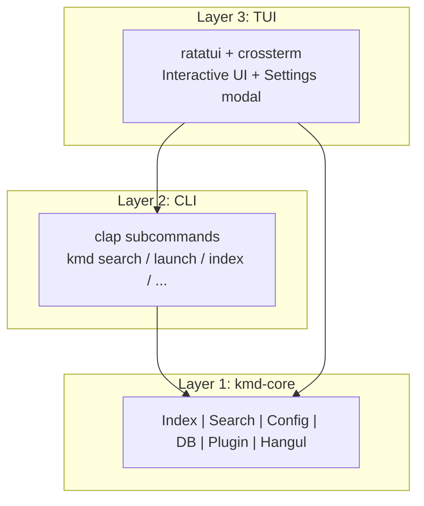

# keymander (kmd)

**키보드 하나로 모든 것을 지휘한다** — CLI-first cross-platform keyboard launcher

A lightweight, portable, keyboard-driven launcher for Windows, macOS, and Linux.
Single binary, fast startup, minimal memory — no Electron, no GUI toolkit, just your terminal.

## Features

- **Cross-platform**: Windows, macOS, Linux with a unified interface
- **CLI-first architecture**: Core logic decoupled from UI — scriptable, testable, extensible
- **Lightweight**: ~3MB binary, ~40ms startup, <5MB RAM
- **Portable**: Single binary + SQLite DB + TOML config = done
- **Smart search**: Fuzzy (Nucleo), glob, regex, substring, URL detection
- **File & folder indexing**: Indexes both files and directories with configurable scan scope
- **Folder drill-down**: Navigate into folders with Tab/→, go back with ←/Esc
- **Web services**: `@g rust tutorial`, `@gh keymander`, `@yt lofi music`
- **AI services**: `@ai question`, `@gpt prompt`, `@claude query`, `@gemini ask`
- **Inline calculator**: Type math expressions anywhere — result appears instantly
- **History-aware**: Frequently used items bubble to the top, recent launches shown on empty query
- **Plugin system**: Extension trait + script-based plugins (JSON over stdin/stdout)
- **Settings modal (F2)**: Configure search priority, scan paths, ignore patterns, display, keybindings — all from within the TUI
- **Korean input**: Built-in 2-벌식 Hangul composer for direct Korean input in terminal raw mode
- **Search priority weights**: Configure which item kinds (folders, apps, files, etc.) rank higher
- **Index cache versioning**: Auto-rebuilds when binary version changes

## Installation

### From source

```bash
cargo install --path .
```

### From releases

Download the latest binary from [GitHub Releases](https://github.com/bullpae/keymander-cli/releases).

## Usage

### TUI Mode (default)

```bash
kmd
```

Launches the interactive TUI launcher. Type to search, arrow keys to navigate, Enter to launch.
Select a folder and press Tab to browse its contents.
By default, kmd exits after launching an item (`quit_on_launch = true`).

### Use as a Global Launcher (Recommended)

kmd is designed to be summoned with a hotkey, used, and then disappear. Set up a system hotkey to launch kmd instantly:

**Windows (PowerToys)**
1. Install [PowerToys](https://github.com/microsoft/PowerToys)
2. Open PowerToys → Keyboard Manager → Remap a shortcut
3. Map `Alt+Space` → Run `wt -w _quake kmd` (Windows Terminal quake mode)

**Windows (AutoHotkey)**
```ahk
!Space::Run "wt" "-w _quake kmd"   ; Alt+Space → kmd in quake terminal
```

**macOS (Hammerspoon)**
```lua
hs.hotkey.bind({"alt"}, "space", function()
  hs.execute("open -a Terminal kmd", true)
end)
```

**Linux (sxhkd)**
```
alt + space
    alacritty --class kmd-float -e kmd
```

> Tip: Set `quit_on_launch = false` in config.toml if you prefer kmd to stay open after launching.

### CLI Commands

```bash
# Search
kmd search "firefox"
kmd search "*.pdf" --json
kmd search "@g rust tutorial"

# Launch
kmd launch "Firefox"
kmd launch ~/documents/report.pdf
kmd launch https://github.com

# Index management
kmd index --stats
kmd index --rebuild

# Configuration
kmd config                    # show config path
kmd config get general.theme
kmd config set general.theme "nord"
kmd config edit               # open in $EDITOR

# History
kmd history list
kmd history clear

# Plugins
kmd plugin list

# Daemon (future)
kmd daemon start
kmd daemon status
```

### Search Modes

| Input | Mode | Example |
|-------|------|---------|
| Regular text | Fuzzy | `fire` → Firefox |
| `*` or `?` | Glob | `*.pdf`, `test?.rs` |
| `/pattern/` | Regex | `/test\d+/` |
| `.ext` | Extension | `.pdf` → `*.pdf` |
| Non-ASCII | Contains | `한글` (exact substring) |
| URL-like | URL | `github.com` → opens browser |
| `@prefix` | Web search | `@g rust tutorial` |
| `:calc` | Calculator | `:calc (2+3)*4` |

### Web Services

| Prefix | Service |
|--------|---------|
| `@g` | Google |
| `@yt` | YouTube |
| `@gh` | GitHub |
| `@so` | StackOverflow |
| `@npm` | npm |
| `@crates` | crates.io |
| `@w` | Wikipedia |
| `@x` | X (Twitter) |
| `@map` | Google Maps |
| `@dict` | Naver Dictionary |

### AI Services

| Prefix | Service |
|--------|---------|
| `@ai` / `@pplx` | Perplexity AI |
| `@gpt` / `@chatgpt` | ChatGPT |
| `@claude` | Claude AI |
| `@gemini` | Google Gemini |

### Keybindings (TUI)

| Key | Action |
|-----|--------|
| `↑` / `↓` | Navigate results |
| `Enter` | Launch selected item |
| `Tab` / `→` | Drill into selected folder |
| `←` | Go back from folder drill-down |
| `Esc` | Exit drill-down / clear query / quit |
| `Ctrl+C` | Quit |
| `Ctrl+P` | Toggle preview panel |
| `Ctrl+Space` | Toggle Korean/English input |
| `F2` | Open settings modal |

## Architecture



- **kmd-core**: Pure library — indexing, search (Nucleo), SQLite, config, plugin system, Hangul composer
- **CLI**: Subcommands that use kmd-core — scriptable, JSON output
- **TUI**: Interactive frontend built on kmd-core — what you see when you run `kmd`

## Configuration

Config file location: `~/.config/kmd/config.toml` (Linux/macOS) or `%APPDATA%/kmd/config.toml` (Windows)

Press **F2** inside the TUI to open the settings modal and edit all options interactively.

```toml
[general]
render_fps = 30
show_preview = true
preview_width_percent = 40
theme = "default"

[launcher]
file_search_provider = "auto"  # auto | builtin | fd | everything | mdfind | locate | winfs
max_results = 10000
search_depth = 6
quit_on_launch = true
index_directories = true       # include folders in search index
scan_drives = true             # auto-discover drive roots (C:\, D:\, etc.)
drive_scan_depth = 3           # shallow depth for drive root scanning

# Search priority weights (0-100, higher = ranked higher)
[launcher.kind_weights]
directory = 80
app = 70
file = 50
executable = 40
system_cmd = 30
web_search = 20

# Directories to scan (platform defaults: Desktop, Documents, Downloads)
# search_paths = ["C:\\Users\\you\\Documents", "D:\\Projects"]

# Patterns to exclude from indexing
# ignore_patterns = [".git", "node_modules", "target", "Windows", "Program Files"]

[keybindings]
global_hotkey = "alt+space"
quit = "ctrl+c"
next = "down"
prev = "up"
select = "enter"
toggle_preview = "ctrl+p"
```

## Tech Stack

| Component | Technology |
|-----------|-----------|
| Language | Rust (edition 2021) |
| TUI | Ratatui + Crossterm |
| Fuzzy search | Nucleo |
| Database | SQLite (rusqlite, bundled) |
| CLI | clap (derive) |
| Config | TOML + serde |
| Theme | Catppuccin Mocha inspired |

## License

MIT
