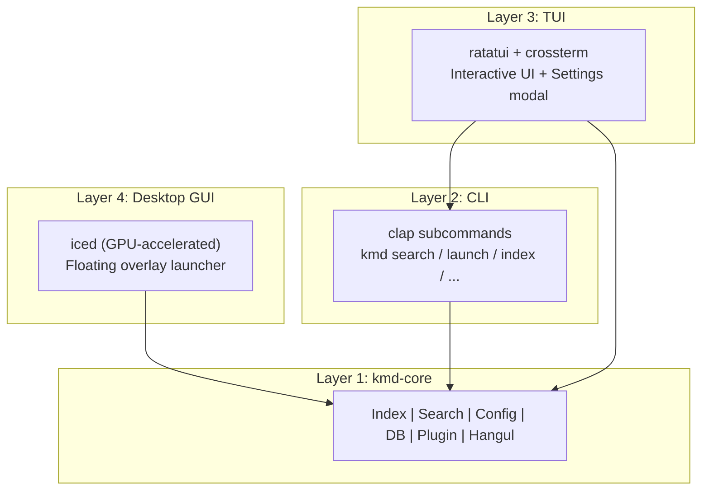

# keymander (kmd)

**키보드 하나로 모든 것을 지휘한다** — CLI-first cross-platform keyboard launcher

A lightweight, portable, keyboard-driven launcher for Windows, macOS, and Linux.
Single binary, fast startup, minimal memory — no Electron, no GUI toolkit overhead.

## Two Interfaces, One Core

| | **kmd** (CLI / TUI) | **kmd-desktop** (Desktop GUI) |
|---|---|---|
| UI | Terminal (ratatui + crossterm) | GPU-accelerated window (iced) |
| Look | Full-screen TUI with preview panel | Floating Spotlight-like search bar |
| Launch | `kmd` or hotkey → terminal | `kmd-desktop` or hotkey → overlay |
| Best for | Terminal power users, scripting | Mouse + keyboard hybrid workflow |

Both share the same **kmd-core** library — identical search, config, index, and plugins.

## Features

- **Cross-platform**: Windows, macOS, Linux with a unified interface
- **CLI-first architecture**: Core logic decoupled from UI — scriptable, testable, extensible
- **Lightweight**: ~3MB binary, instant startup, <5MB RAM
- **Portable**: Single binary + SQLite DB + TOML config = done
- **Smart search**: Fuzzy (Nucleo), glob, regex, substring, URL detection
- **File & folder indexing**: Indexes both files and directories with configurable scan scope
- **Folder drill-down** (TUI): Navigate into folders with Tab/→, go back with ←/Esc
- **Web services**: `@g rust tutorial`, `@gh keymander`, `@yt lofi music`
- **AI services**: `@ai question`, `@gpt prompt`, `@claude query`, `@gemini ask`
- **Inline calculator**: Type math expressions anywhere — result appears instantly
- **Emoji search**: `:emoji fire` or `:e 하트` — search & copy Unicode emoji (English + Korean)
- **Shell commands**: `!ip`, `!hostname`, `!uptime` — quick system info, or run any shell command
- **Single-instance toggle**: Hotkey press toggles on/off — no duplicate windows
- **History-aware** (TUI): Frequently used items bubble to the top
- **Plugin system**: Extension trait + script-based plugins (JSON over stdin/stdout)
- **Settings** (TUI): F2 key opens settings modal; (Desktop): `:set` command
- **Theming** (Desktop): 5 built-in presets — Midnight, Obsidian, Snow, Rose Pine, Nord
- **Korean input** (TUI): Built-in 2-벌식 Hangul composer for direct Korean input
- **Search priority weights**: Configure which item kinds rank higher
- **Index cache versioning**: Auto-rebuilds when binary version changes

## Installation

### From source

```bash
# CLI + TUI
cargo install --path .

# Desktop GUI
cargo install --path crates/kmd-desktop
```

### From releases

Download the latest binary from [GitHub Releases](https://github.com/bullpae/keymander-cli/releases).

## Usage

### Desktop Mode (kmd-desktop)

```bash
kmd-desktop
```

Launches a floating, borderless, transparent search window (Spotlight-like) with square corners.
Type to search, arrow keys to navigate, Enter to launch, Esc to dismiss.
Drag the top strip to move the window; drag the left or right edges to resize.
The window disappears after launching an item.

**Setting up a global hotkey:**

**Windows (AutoHotkey)**
```ahk
!Space::Run "kmd-desktop"   ; Alt+Space → kmd-desktop overlay
```

**Windows (PowerToys)**
1. Install [PowerToys](https://github.com/microsoft/PowerToys)
2. Open PowerToys → Keyboard Manager → Remap a shortcut
3. Map `Alt+Space` → Run `kmd-desktop`

### TUI Mode (default CLI)

```bash
kmd
```

Launches the interactive TUI launcher. Type to search, arrow keys to navigate, Enter to launch.
Select a folder and press Tab to browse its contents.
By default, kmd exits after launching an item (`quit_on_launch = true`).

**Use as a Global Launcher:**

kmd is designed to be summoned with a hotkey, used, and then disappear. **Single-instance toggle**: pressing the hotkey again while kmd is already open closes the existing instance.

**Windows (AutoHotkey)**
```ahk
!Space::Run "wt" "-w _quake kmd"   ; Alt+Space → kmd in quake terminal
```

**macOS (Hammerspoon)**
```lua
hs.hotkey.bind({"alt"}, "space", function()
  hs.execute("open -a Terminal kmd", true)
end)
```

**Linux (sxhkd)**
```
alt + space
    alacritty --class kmd-float -e kmd
```

### CLI Commands

```bash
# Search
kmd search "firefox"
kmd search "*.pdf" --json
kmd search "@g rust tutorial"

# Launch
kmd launch "Firefox"
kmd launch ~/documents/report.pdf
kmd launch https://github.com

# Index management
kmd index --stats
kmd index --rebuild

# Portable mode
kmd portable enable   # use kmd-data/ next to exe
kmd portable disable  # use standard config/data dirs

# Configuration
kmd config                    # show config path
kmd config get general.theme
kmd config set general.theme "nord"
kmd config edit               # open in $EDITOR

# History
kmd history list
kmd history clear

# Emoji search & copy
kmd emoji fire          # search and copy first result
kmd emoji heart --list  # list all matches
kmd emoji 하트 --json   # JSON output
kmd emoji star -c 3     # copy 3rd result

# Plugins
kmd plugin list

# Daemon (future)
kmd daemon start
kmd daemon status
```

## Search Modes

| Input | Mode | Example |
|-------|------|---------|
| Regular text | Fuzzy | `fire` → Firefox |
| `*` or `?` | Glob | `*.pdf`, `test?.rs` |
| `/pattern/` | Regex | `/test\d+/` |
| `.ext` | Extension | `.pdf` → `*.pdf` |
| Non-ASCII | Contains | `한글` (exact substring) |
| URL-like | URL | `github.com` → opens browser |

## Special Command Prefixes

Type `:help` (or `:h`) in the search bar to see all available commands.
In `:help`, selecting an entry and pressing Enter fills a starter query (quick template).

| Prefix | Mode | Example | Description |
|--------|------|---------|-------------|
| `@prefix` | Web search | `@g rust tutorial` | Search via web service |
| `@ai` | AI search | `@ai why is the sky blue` | Ask Perplexity AI |
| `:calc` | Calculator | `:calc (2+3)*4` | Evaluate math expression |
| `:emoji` / `:e` | Emoji | `:e fire`, `:e 하트` | Search & copy emoji |
| `:set` / `:settings` | Settings | `:set`, `:settings theme` | Manage config, themes, index |
| `:help` / `:h` | Help | `:help` | Show all available commands |
| `!command` | Shell | `!ip`, `!echo hello` | Run shell command |

### Web Services

| Prefix | Service |
|--------|---------|
| `@g` | Google |
| `@yt` | YouTube |
| `@gh` | GitHub |
| `@so` | StackOverflow |
| `@npm` | npm |
| `@crates` | crates.io |
| `@w` | Wikipedia |
| `@x` | X (Twitter) |
| `@map` | Google Maps |
| `@dict` | Naver Dictionary |

### AI Services

| Prefix | Service |
|--------|---------|
| `@ai` / `@pplx` | Perplexity AI |
| `@gpt` / `@chatgpt` | ChatGPT |
| `@claude` | Claude AI |
| `@gemini` | Google Gemini |

## Keybindings

### Desktop (kmd-desktop)

| Key | Action |
|-----|--------|
| `↑` / `↓` | Navigate results |
| `Enter` | Launch selected item |
| `Esc` | If query exists: clear + refocus input. If empty: quit |
| Mouse click | Select and launch item |
| Logo left-click (`»`) | Toggle `:help` |
| Logo right-click (`»`) | Toggle `:set` |
| Drag top strip | Move window |
| Drag left/right edges | Resize window |

### TUI (kmd)

| Key | Action |
|-----|--------|
| `↑` / `↓` | Navigate results |
| `Enter` | Launch selected item |
| `Tab` / `→` | Drill into selected folder |
| `←` | Go back from folder drill-down |
| `Esc` | Exit drill-down / clear query / quit |
| `Ctrl+C` | Quit |
| `Ctrl+P` | Toggle preview panel |
| `Ctrl+Space` | Toggle Korean/English input |
| `F2` | Open settings modal |

## Architecture



- **kmd-core**: Pure library — indexing, search (Nucleo), SQLite, config, plugin system, Hangul composer
- **CLI**: Subcommands that use kmd-core — scriptable, JSON output
- **TUI**: Interactive frontend built on kmd-core — what you see when you run `kmd`
- **Desktop**: GPU-accelerated overlay launcher — what you see when you run `kmd-desktop`

## Desktop Themes

kmd-desktop includes 5 built-in themes. Change via `:set` command or `config.toml`:

| Theme | Description |
|-------|-------------|
| **Midnight** (default) | Deep blue, keymander signature |
| **Obsidian** | OLED black, ultra-minimal |
| **Snow** | Clean light theme |
| **Rose Pine** | Warm, soft palette |
| **Nord** | Calm Scandinavian palette |

```toml
# config.toml — set theme
[general]
theme = "midnight"   # midnight | obsidian | snow | rose_pine | nord
```

## Configuration

Config file location: `~/.config/kmd/config.toml` (Linux/macOS) or `%APPDATA%/kmd/config.toml` (Windows)

- **TUI**: Press **F2** to open the settings modal
- **Desktop**: Type `:set` or `:settings` in the search bar

```toml
[general]
render_fps = 30
show_preview = true
preview_width_percent = 40
theme = "default"        # TUI theme | Desktop theme (midnight/obsidian/snow/rose_pine/nord)
emoji_icons = true       # emoji icons (false = ASCII fallback)
reset_ime_on_launch = true  # Desktop: reset IME to English mode on open

[launcher]
file_search_provider = "auto"  # auto | builtin | fd | everything | mdfind | locate | winfs
max_results = 10000
search_depth = 6
quit_on_launch = true
index_directories = true       # include folders in search index
scan_drives = true             # auto-discover drive roots (C:\, D:\, etc.)
drive_scan_depth = 3           # shallow depth for drive root scanning

# Search priority weights (0-100, higher = ranked higher)
[launcher.kind_weights]
directory = 80
app = 70
file = 50
executable = 40
system_cmd = 30
web_search = 20

# Directories to scan (platform defaults: Desktop, Documents, Downloads)
# search_paths = ["C:\\Users\\you\\Documents", "D:\\Projects"]

# Patterns to exclude from indexing
# ignore_patterns = [".git", "node_modules", "target", "Windows", "Program Files"]

[keybindings]
global_hotkey = "alt+space"
quit = "ctrl+c"
next = "down"
prev = "up"
select = "enter"
toggle_preview = "ctrl+p"
```

## Tech Stack

| Component | Technology |
|-----------|-----------|
| Language | Rust (edition 2021) |
| Core | kmd-core (shared library) |
| TUI | Ratatui + Crossterm |
| Desktop GUI | iced 0.14 (GPU-accelerated) |
| Fuzzy search | Nucleo |
| Database | SQLite (rusqlite, bundled) |
| CLI | clap (derive) |
| Config | TOML + serde |
| Theme | Catppuccin Mocha inspired (TUI) / 5 presets (Desktop) |

## Roadmap

**v0.2.0** (current)
- Desktop GUI launcher (kmd-desktop) with iced
- 5 built-in themes (Midnight, Obsidian, Snow, Rose Pine, Nord)
- Emoji search & copy (English + Korean)
- Shell command execution & system quick actions
- Single-instance toggle (hotkey on/off)
- Built-in Hangul composer with auto-activation
- Performance optimizations (async engine loading, reduced tick timeout)
- `:help` command for discoverability

**Toward v1.0.0**
- Cloud-synced todo / memo (remote storage integration)
- Clipboard history manager
- Plugin marketplace & script-based plugins
- Global hotkey daemon (cross-platform)
- Custom theming engine (user-defined color schemes)
- Multi-monitor awareness
- Glassmorphism effects (Desktop)
- Auto-growing search input for AI prompts (Desktop)

## License

MIT
