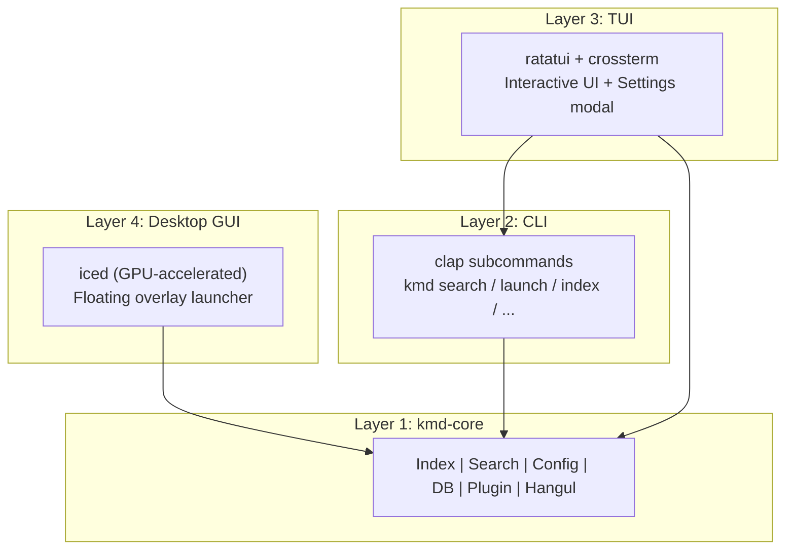

# keymander (kmd)

**키보드 하나로 모든 것을 지휘한다** — one keymap, three OSes, hands on home row.

[한국어 README](README.ko.md)

---

## Have you ever counted how often your hands leave the keyboard?

You reach for the mouse to open an app. Your right hand leaves home row for one
arrow key. You press `Cmd+Space` at home, `Alt+Space` at work, and something
else entirely on your Linux box — three sets of muscle memory for one brain.

keymander was built to end those three departures:

1. **The departure to the mouse.** A launcher summons any app, file, folder, or
   web search from a single floating bar — and a hold-layer moves the *pointer
   itself* from the keyboard when a click is truly unavoidable.
2. **The departure from home row.** Arrow keys, Home/End, PageUp/Down,
   even Ctrl — all reachable without moving your hands, via hold-layers and
   tap-hold keys inspired by Vim and the HHKB.
3. **The departure between operating systems.** The same keymap, the same
   launcher, the same finger movements on Windows, macOS, and Linux. Sit down
   anywhere; your hands already know what to do.

It fits in a single ~3MB binary. No Electron, no runtime, no ceremony.

## Philosophy

- **One keymap, three OSes.** Whatever machine you sit at, your hands speak the
  same language. This is the reason the project exists.
- **Hands on home row.** Navigation, editing, launching, even pointing — done
  through hold-layers so fingers never travel. And one ergonomic rule runs
  through every default layout: **the hand that holds a layer is never the hand
  that operates it.** Left-hand `LAlt` hold drives right-hand HJKL navigation;
  right-thumb `RAlt` hold drives left-hand ESDF pointer movement. No one-handed
  claw grips.
- **One binary, no ceremony.** Portable install, SQLite + one TOML file,
  instant startup, <5MB RAM.

## Your first 60 seconds

```bash
# 1. Install (macOS / Linux — see below for Windows & source builds)
brew install bullpae/tap/keymander

# 2. Summon the launcher
kmd-desktop

# 3. Type a few letters of anything — an app, a file, a folder — and press Enter
```

That's the whole loop: **summon → type → Enter**. Everything else in keymander
is this loop applied to more things (web, AI, emoji, shell, translation), plus
a keymap that keeps your hands still while you do it.

To make summoning instant, bind a global hotkey to `kmd-desktop`
(recommended: `Alt+Space` — [setup per OS](#setting-up-a-global-hotkey)).

## Missions: a day without leaving home row

Reading a feature list teaches nothing; your fingers have to feel the intent.
Each mission below is a real work situation. Do it, then run the self-check.

First, activate the keymap (this enables missions 2–4):

```bash
kmd keymap init vim-nav    # install the vim-nav preset
kmd keymap start           # start it (kanata backend)
```

> Backends: [kanata](https://github.com/jtroo/kanata) works on all three OSes
> and is the only path on Linux. On Windows/macOS the built-in daemon
> (`kmd daemon start`) provides the same mappings natively, without kanata.

### Mission 1 — Summon, don't search

*Situation: you need Firefox, a PDF from last month, and a GitHub repo page.*

| Do | Keys |
|----|------|
| Open an app | `Alt+Space` → `fire` → `Enter` |
| Find a file by extension | `Alt+Space` → `.pdf` → `↓` `Enter` |
| Search GitHub | `Alt+Space` → `@gh keymander` → `Enter` |

**Self-check:** did your hand touch the mouse? Did you open a file explorer?
If no — mission complete.

### Mission 2 — Arrows without arrow keys

*Situation: you're editing a document and need to move around.*

| Do | Keys |
|----|------|
| Move cursor | hold `LAlt` + `H J K L` |
| Page up / down | hold `LAlt` + `N` / `M` |
| Jump by word, line start/end | hold `LAlt` + `I` / `O` |

**Why this layout:** left hand holds, right hand moves — the Vim home-row
positions, available in *every* app, not just your editor.

**Self-check:** did your right hand travel to the arrow cluster? It shouldn't
need to, ever again.

### Mission 3 — Ctrl without the pinky dive

*Situation: copy, paste, save — a hundred times a day.*

| Do | Keys |
|----|------|
| Copy / paste / save | hold `CapsLock` + `C` / `V` / `S` |
| Actual CapsLock | tap `CapsLock` |

This is the HHKB's famous mod-tap: the strongest position on the keyboard
(home row, left pinky) stops being wasted on a lock key. The hold decision is
instant — the moment you press the second key, it's Ctrl. No 200ms lag.

**Self-check:** did your left pinky curl down to the corner Ctrl? Watch it
stop doing that within a week.

### Mission 4 — Click without the mouse

*Situation: a dialog appears; one button needs clicking. It's not worth moving
your whole arm.*

| Do | Keys |
|----|------|
| Move the pointer | hold `RAlt` (right thumb) + `W A S D` (left hand) |
| Precision mode | + hold `LShift` |
| Click / drag | `Space` (hold to drag) |
| Right / middle click | `J` / `K` |

**Why this layout:** most real mouse use is *move-then-click* — travel to a
target and activate it. So movement accelerates (slow start for aiming, fast
ramp for distance), the click sits on your strongest key (Space), and the
holding thumb (right) never operates the movement keys (left). On Korean
Windows keyboards, a short `RAlt` tap still toggles 한/영 — only the hold
opens the layer.

**Self-check:** dialog dismissed, hands never left the board.

### Mission 5 — Same hands, different machine

*Situation: you switch from your Mac to a Windows laptop, or SSH day on Linux.*

Repeat missions 1–4 on your other OS. Same keys, same layers, same muscle
memory. This mission is the whole point of keymander.

**Graduation rule (vimtutor style):** run missions 1–4 as your actual workflow
for three consecutive days with zero mouse pickups for launching/navigation.
When it stops feeling like practice, you've graduated.

> **Coming: `kmd dojo`** — an interactive trainer that turns these missions
> into timed, scored practice rounds inside the TUI. See the
> [roadmap](#roadmap).

---

## Two Interfaces, One Core

| | **kmd** (CLI / TUI) | **kmd-desktop** (Desktop GUI) |
|---|---|---|
| UI | Terminal (ratatui + crossterm) | GPU-accelerated window (iced) |
| Look | Full-screen TUI with preview panel | Floating Spotlight-like search bar |
| Launch | `kmd` or hotkey → terminal | `kmd-desktop` or hotkey → overlay |
| Best for | Terminal power users, scripting | Mouse + keyboard hybrid workflow |

Both share the same **kmd-core** library — identical search, config, index, and plugins.

## Features at a glance

**Launch & search** — fuzzy (Nucleo) / glob / regex / substring / URL detection;
file & folder indexing with drill-down; Smart Directory Jump with
frecency-based learning (`2026 출장이력` → `c:\2026\work\출장이력`); frecency
history with auto-pruning; inline calculator; single-instance hotkey toggle.

**Web & AI** — `@g` `@gh` `@yt` web searches; `@ai` `@gpt` `@claude` `@gemini`
`@grok` AI services; `@ll` multi-LLM compare (+ opt-in autopilot on Windows);
`@m` multi-engine web search; `@sp` Korean spelling check; `@tr` translation;
prompt templates; Quick Transform from clipboard.

**Keymap** — vim-nav & minimal presets over two backends (kanata / native
daemon); Vim navigation layer; HHKB-style CapsLock mod-tap; accelerated mouse
layer; `:km` control from the launcher; per-key customization in TOML.

**Everything else** — emoji search (`:e fire` / `:e 하트`), shell commands
(`!ip`), plugin system (JSON over stdio), 5 desktop themes, built-in 2-벌식
Hangul composer (TUI), portable mode, search priority weights.

## Installation

### Homebrew (macOS / Linux)

```bash
brew install bullpae/tap/keymander
```

Installs `kmd` (TUI/CLI), `kmd-desktop`, and `kmd-daemon`. A starter config is
available at `$(brew --prefix)/share/keymander/config.example.toml`.

### From source

```bash
# CLI + TUI
cargo install --path .

# Desktop GUI
cargo install --path crates/kmd-desktop
```

### From releases

Download the latest binary from [GitHub Releases](https://github.com/bullpae/keymander-cli/releases).
Verify downloads against the `SHA256SUMS.txt` attached to each release:

```bash
shasum -a 256 -c SHA256SUMS.txt --ignore-missing
```

## Usage

### Desktop Mode (kmd-desktop)

```bash
kmd-desktop
```

Launches a floating, borderless, transparent search window (Spotlight-like).
Type to search, arrow keys to navigate, Enter to launch, Esc to dismiss.
Drag the top strip to move the window; drag the left or right edges to resize.
The window disappears after launching an item.

#### Setting up a global hotkey

**Windows (AutoHotkey)**
```ahk
!Space::Run "kmd-desktop"   ; Alt+Space → kmd-desktop overlay
```

**Windows (PowerToys)**
1. Install [PowerToys](https://github.com/microsoft/PowerToys)
2. Open PowerToys → Keyboard Manager → Remap a shortcut
3. Map `Alt+Space` → Run `kmd-desktop`

**macOS (Hammerspoon)**
```lua
hs.hotkey.bind({"alt"}, "space", function()
  hs.execute("open -a Terminal kmd", true)
end)
```

**Linux (sxhkd)**
```
alt + space
    alacritty --class kmd-float -e kmd
```

**Or let the keymap do it:** the `vim-nav` preset binds `Alt+Space` →
kmd-desktop out of the box (missions above).

### TUI Mode (default CLI)

```bash
kmd
```

Launches the interactive TUI launcher. Type to search, arrow keys to navigate,
Enter to launch. Select a folder and press Tab to browse its contents. By
default, kmd exits after launching an item (`quit_on_launch = true`).

kmd is designed to be summoned with a hotkey, used, and then disappear —
pressing the hotkey again while kmd is already open closes the existing
instance.

### Keymap (vim-nav preset)

```bash
kmd keymap init vim-nav    # install preset and set active
kmd keymap start           # start kanata with the active profile
kmd keymap status          # show keymap process status
kmd keymap list-presets    # all built-in presets
```

The `vim-nav` preset provides:
- `LAlt` hold + HJKL = arrow keys, N/M = PageUp/Down, I/O = word jump / Home/End
- `LAlt` + `.` / `/` = Backspace / Delete (plain taps — mash them freely),
  `,` = delete word back, `Y` / `U` = copy / delete line (vim `yy` / `dd`)
- `LAlt` + Space = launch kmd-desktop; `LAlt` tap alone = Esc
- CapsLock mod-tap: tap = CapsLock, hold + key = Ctrl combo (HHKB-style)
- `RAlt` hold = mouse layer: ESDF pointer move (accelerated, keeps the typing
  home position), R/V wheel, Space left-click/drag, C/G right/middle click,
  J/K/L click aliases, LShift precision — on Korean Windows keyboards a short
  RAlt tap still toggles 한/영
- Every key is customizable in `config.toml`
  ([config reference](docs/06_config_reference.md))

Register kanata (or `kmd daemon`) as an OS startup program for a persistent
keymap.

### CLI Commands

```bash
# Search
kmd search "firefox"
kmd search "*.pdf" --json
kmd search "@g rust tutorial"

# Launch
kmd launch "Firefox"
kmd launch ~/documents/report.pdf
kmd launch https://github.com

# Index management
kmd index --stats
kmd index --rebuild

# Portable mode
kmd portable enable   # use kmd-data/ next to exe
kmd portable disable  # use standard config/data dirs

# Configuration
kmd config                    # show config path
kmd config get general.theme
kmd config set general.theme "nord"
kmd config edit               # open in $EDITOR

# History
kmd history list
kmd history clear

# Emoji search & copy
kmd emoji fire          # search and copy first result
kmd emoji heart --list  # list all matches
kmd emoji 하트 --json   # JSON output
kmd emoji star -c 3     # copy 3rd result

# Plugins
kmd plugin list

# Keymap management (Kanata)
kmd keymap status          # show keymap process status
kmd keymap init vim-nav    # install preset and set active
kmd keymap list            # list installed profiles
kmd keymap list-presets    # show available built-in presets
kmd keymap use vim-nav     # switch active profile
kmd keymap start           # start kanata with active profile
kmd keymap stop            # stop kanata process

# Daemon (native keymap backend + LLM autopilot)
kmd daemon start
kmd daemon status
kmd daemon stop
```

## Search Modes

| Input | Mode | Example |
|-------|------|---------|
| Regular text | Fuzzy | `fire` → Firefox |
| `*` or `?` | Glob | `*.pdf`, `test?.rs` |
| `/pattern/` | Regex | `/test\d+/` |
| `.ext` | Extension | `.pdf` → `*.pdf` |
| Non-ASCII (single word) | Contains | `한글` (exact substring) |
| Non-ASCII (multi-word) | Smart Match | `2026 출장이력` (AND match on path segments) |
| URL-like | URL | `github.com` → opens browser |

## Special Command Prefixes

Type `:help` (or `:h`) in the search bar to see all available commands — works
in both the TUI and the desktop app. In `:help`, selecting an entry and
pressing Enter fills a starter query (quick template).

Command aliases match on a token boundary: `:e fire` is the emoji search, but
`:example` is just a regular search. Every `:` command can also be typed with a
leading `/` (e.g. `/help`, `/calc 2+3`). Unknown `:command` input shows an
"unknown command" hint pointing to `:help`.

| Prefix | Mode | Example | Description |
|--------|------|---------|-------------|
| `@prefix` | Web search | `@g rust tutorial` | Search via web service |
| `@ai` | AI search | `@ai why is the sky blue` | Ask Perplexity AI |
| `@ll` / `@llm` / `@multi` / `@cmp` / `@compare` | Multi LLM compare | `@ll explain Rust lifetimes` | Open selected LLMs with same prompt |
| `@m` / `@mw` / `@msearch` / `@multisearch` / `@searchall` / `@krsearch` | Multi web search | `@m 러스트 소유권` | Open selected search engines with same query |
| `@sp` / `@spell` | Korean spelling check | `@sp 안녕 하세요` | Open selected spell check providers |
| `@tr` / `@trko` / `@tren` | Translate | `@trko hello world` | Translate text in selected providers |
| `:calc` | Calculator | `:calc (2+3)*4` | Evaluate math expression |
| `:emoji` / `:e` | Emoji | `:e fire`, `:e 하트` | Search & copy emoji |
| `:t` / `:transform` | Quick Transform | `:t spell`, `:t trko text` | Clipboard text → spell check / translate |
| `:prompt` / `:pt` | Prompt templates | `:prompt add review ...` | Manage reusable prompt templates for `@ll` |
| `:f` | Folder search | `:f ~/docs report` | Search inside a specific folder |
| `:keys` / `:k` | Keybinding sheet | `:keys` | Show keybinding cheatsheet |
| `:keymap` / `:km` | Keymap control | `:km on`, `:km off` | Keymap status, on/off, profile switch |
| `:set` / `:settings` | Settings | `:set`, `:settings theme` | Manage config, themes, index |
| `:version` / `:ver` / `:v` | Version info | `:version` | Show app/core/target/os versions |
| `:help` / `:h` | Help | `:help` | Show all available commands |
| `!command` / `>command` | Shell | `!ip`, `>echo hello` | Run shell command |

Coming from DuckDuckGo bangs? Typing `!g rust` runs a shell command here — but
kmd shows a one-line hint offering to switch to the `@g rust` web search.

### Web Services

| Prefix | Service |
|--------|---------|
| `@g` | Google |
| `@yt` | YouTube |
| `@gh` | GitHub |
| `@so` | StackOverflow |
| `@npm` | npm |
| `@crates` | crates.io |
| `@w` | Wikipedia |
| `@x` | X (Twitter) |
| `@map` | Google Maps |
| `@naver` / `@kr` | Naver Search |
| `@daum` | Daum Search |
| `@dict` | Naver Dictionary |

### AI Services

| Prefix | Service |
|--------|---------|
| `@ai` / `@pplx` | Perplexity AI |
| `@gpt` / `@chatgpt` | ChatGPT |
| `@claude` | Claude AI |
| `@gemini` | Google Gemini |
| `@grok` | xAI Grok |

### Multi LLM Prompting

`@ll` (or `@llm`, `@multi`, `@cmp`) sends one prompt to multiple LLM web UIs by
opening each selected provider URL in parallel browser tabs.

- `@ll summarize this article` — compare multiple LLM answers quickly
- `@gpt write unit tests for this Rust function`
- `@claude refactor this module for readability`
- `@ai find latest docs and sources for this topic` (Perplexity)

#### LLM Autopilot (opt-in, Windows + daemon)

By default, ChatGPT/Claude only *prefill* the prompt (they no longer
auto-submit from an external link), and Gemini ignores URL parameters entirely
— so you have to paste/press Enter yourself. With the daemon running you can
enable **autopilot**:

```toml
[launcher]
llm_autopilot = true
```

The daemon then opens the LLM, waits until the **foreground window is that
browser with the expected title**, and injects Enter (ChatGPT/Claude) or
Ctrl+V→Enter (Gemini) so the prompt actually runs. It only injects when the
window check passes — if you click away it silently skips, leaving the
prefilled/clipboard text for you to finish manually. No browser extension
required.

- **Follow-up to all open LLMs**: after an autopilot launch, type `@@ your
  next question` to send a follow-up to every LLM window it opened this
  session.

Autopilot is off by default (auto key injection is opt-in) and currently
Windows-only.

### Multi Web Search / Spelling / Translate

- `@m rust ownership` — one query on Google/Naver/Daum in parallel tabs
- `@sp 안녕 하세요 오늘 날씨가 좋내요` — Korean spelling check across providers
- `@tr hello world` (auto), `@trko ...` (EN→KO), `@tren ...` (KO→EN)

## Keybindings

### Desktop (kmd-desktop)

| Key | Action |
|-----|--------|
| `↑` / `↓` | Navigate results |
| `Enter` | Launch selected item |
| `Esc` | If query exists: clear + refocus input. If empty: quit |
| Mouse click | Select and launch item |
| Logo left-click (`»`) | Toggle `:help` |
| Logo right-click (`»`) | Toggle `:set` |
| Drag top strip | Move window |
| Drag left/right edges | Resize window |

### TUI (kmd)

| Key | Action |
|-----|--------|
| `↑` / `↓` | Navigate results |
| `Enter` | Launch selected item |
| `Tab` / `→` | Drill into selected folder |
| `←` | Go back from folder drill-down |
| `Esc` | Exit drill-down / clear query / quit |
| `Ctrl+C` | Quit |
| `Ctrl+P` | Toggle preview panel |
| `Ctrl+Space` | Toggle Korean/English input |
| `F2` | Open settings modal |

## Architecture



- **kmd-core**: Pure library — indexing, search (Nucleo), SQLite, config,
  plugin system, Hangul composer
- **CLI**: Subcommands that use kmd-core — scriptable, JSON output
- **TUI**: Interactive frontend built on kmd-core — what you see when you run `kmd`
- **Desktop**: GPU-accelerated overlay launcher — what you see when you run `kmd-desktop`
- **Daemon (kmd-daemon)**: Native keymap engine (Windows/macOS key hooks,
  tap-hold, mouse layer) + LLM autopilot

## Desktop Themes

kmd-desktop includes 5 built-in themes. Change via `:set` command or `config.toml`:

| Theme | Description |
|-------|-------------|
| **Midnight** (default) | Deep blue, keymander signature |
| **Obsidian** | OLED black, ultra-minimal |
| **Snow** | Clean light theme |
| **Rose Pine** | Warm, soft palette |
| **Nord** | Calm Scandinavian palette |

```toml
# config.toml — set theme
[general]
theme = "midnight"   # midnight | obsidian | snow | rose_pine | nord
```

## Configuration

Config file location: `~/.config/kmd/config.toml` (Linux/macOS) or
`%APPDATA%/kmd/config.toml` (Windows)

- **TUI**: Press **F2** to open the settings modal
- **Desktop**: Type `:set` or `:settings` in the search bar
- Full option list: [config reference](docs/06_config_reference.md)

```toml
[general]
render_fps = 30
show_preview = true
preview_width_percent = 40
theme = "default"        # TUI theme | Desktop theme (midnight/obsidian/snow/rose_pine/nord)
emoji_icons = true       # emoji icons (false = ASCII fallback)
reset_ime_on_launch = true  # Desktop: reset IME to English mode on open

[launcher]
file_search_provider = "auto"  # auto | builtin | fd | everything | mdfind | locate | winfs
max_results = 5000
search_depth = 4
quit_on_launch = true
index_directories = true       # include folders in search index
scan_drives = false            # auto-discover drive roots (C:\, D:\, etc.)
drive_scan_depth = 2           # shallow depth for drive root scanning
multi_llm_providers = ["chatgpt", "gemini", "claude", "grok", "perplexity"]  # providers used by @llm
multi_llm_prefixes = ["@ll", "@llm", "@multi", "@cmp", "@compare"]            # aliases for multi-LLM command
multi_web_providers = ["google", "naver_search", "daum"]  # engines used by @msearch
multi_web_prefixes = ["@m", "@mw", "@msearch", "@multisearch", "@searchall", "@krsearch"]  # aliases for multi-web command
spell_providers = ["naver_spell", "pusan_spell"]
spell_prefixes = ["@sp", "@spell"]
translate_providers = ["google_translate", "papago", "deepl"]
translate_prefixes = ["@tr", "@trko", "@tren"]

[launcher.keymap]
backend = "kanata"
kanata_path = ""              # optional absolute path
profile_dir = ""              # optional profile dir (default: config_dir/keymap)
active_profile = "vim-nav"

# HHKB-style mod-tap customization
[launcher.keymap.tap_holds.CapsLock]
tap = "CapsLock"
hold = "LCtrl"

# Search priority weights (0-100, higher = ranked higher)
[launcher.kind_weights]
directory = 80
app = 70
file = 50
executable = 40
system_cmd = 30
web_search = 20

# Directories to scan (platform defaults: Desktop, Documents, Downloads)
# search_paths = ["C:\\Users\\you\\Documents", "D:\\Projects"]

# Patterns to exclude from indexing
# ignore_patterns = [".git", "node_modules", "target", "Windows", "Program Files"]

[keybindings]
global_hotkey = "alt+space"
toggle_keymap = "ctrl+alt+k"   # temporarily disable/enable daemon key mappings
quit = "ctrl+c"
next = "down"
prev = "up"
select = "enter"
toggle_preview = "ctrl+p"
```

## Tech Stack

| Component | Technology |
|-----------|-----------|
| Language | Rust (edition 2021) |
| Core | kmd-core (shared library) |
| TUI | Ratatui + Crossterm |
| Desktop GUI | iced 0.14 (GPU-accelerated) |
| Fuzzy search | Nucleo |
| Database | SQLite (rusqlite, bundled) |
| CLI | clap (derive) |
| Config | TOML + serde |
| Theme | Catppuccin Mocha inspired (TUI) / 5 presets (Desktop) |

## Roadmap

**Toward v1.0.0**
- **`kmd dojo`** — interactive keymap trainer: timed missions, scores, streaks
  ([plan](docs/10_dojo_plan.md))
- Cloud-synced todo / memo (remote storage integration)
- Clipboard history manager
- Plugin marketplace & script-based plugins
- Global hotkey daemon (cross-platform)
- Custom theming engine (user-defined color schemes)
- Multi-monitor awareness
- Glassmorphism effects (Desktop)
- Auto-growing search input for AI prompts (Desktop)

Release history: see [CHANGELOG.md](CHANGELOG.md).

## License

MIT
