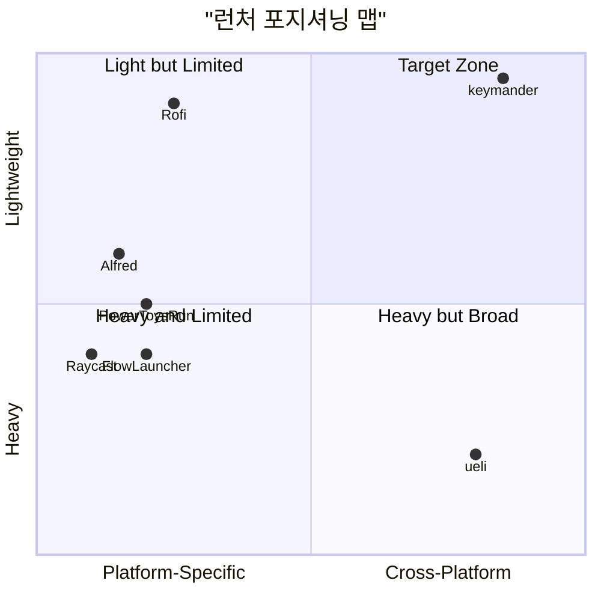
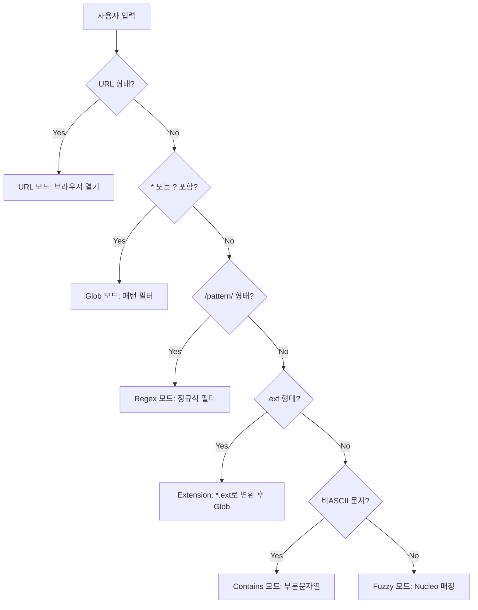
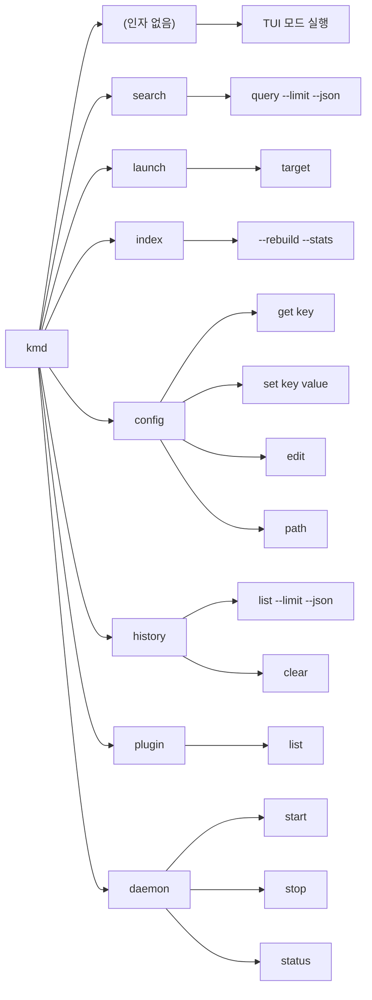
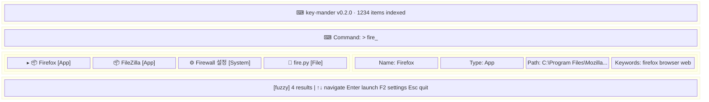
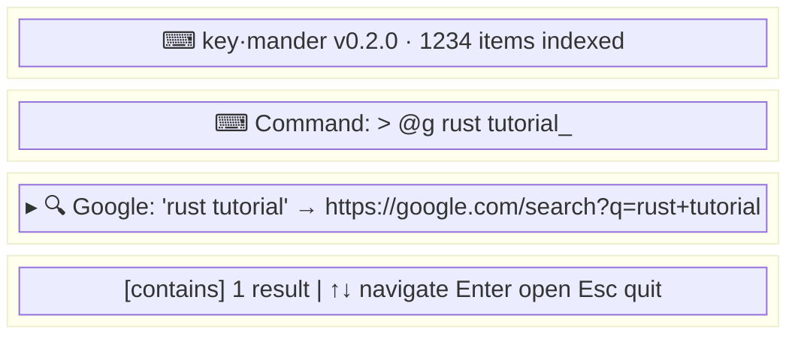
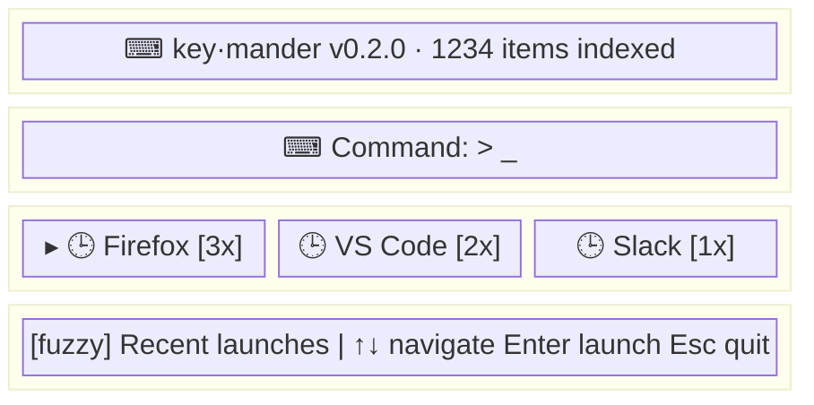
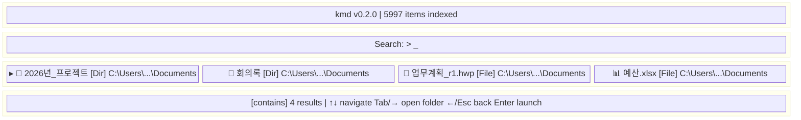
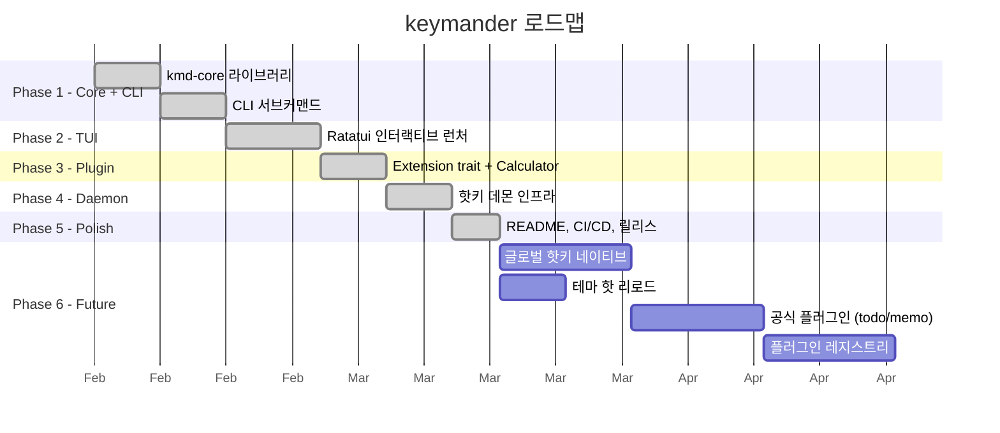

# Product Requirements Document (PRD)

## 1. 개요

### 1.1 제품명
**keymander** (바이너리명: `kmd`)

### 1.2 슬로건
> 키보드 하나로 모든 것을 지휘한다 — CLI-first cross-platform keyboard launcher

### 1.3 문제 정의

컴퓨터에서 새로운 작업을 시작할 때마다 마우스로 손을 이동하여 프로그램을 찾고 실행하는 행위는 키보드 중심 작업 흐름을 크게 방해한다. 기존 키보드 런처들은 다음 한계를 가진다:

| 문제 | 해당 도구 |
|------|----------|
| macOS 전용 | Raycast, Alfred, Spotlight |
| Windows 전용 | PowerToys Run, Flow Launcher |
| Linux 전용 | Rofi, Albert, Ulauncher |
| 크로스플랫폼이나 무거움 (Electron) | ueli, LaunchMenu |
| 크로스플랫폼이나 미완성 | Kunkun, Launchy |

#### 경쟁 포지셔닝

**빈 시장**: "크로스플랫폼 + 경량 + 통일 인터페이스"를 동시에 만족하는 런처가 없다.

### 1.4 해결 방안
Rust 기반 단일 바이너리 TUI 런처. GUI 툴킷 불필요, 터미널에서 동작하므로 진정한 크로스플랫폼. CLI-first 아키텍처로 스크립팅과 자동화 지원.

### 1.5 목표 사용자
- 터미널 중심 개발자
- 여러 OS를 오가며 일관된 워크플로를 원하는 사용자
- SSH/원격 환경에서도 런처를 사용하고 싶은 사용자
- Electron 런처의 무거움에 불만인 사용자

---

## 2. 설계 원칙

| 원칙 | 설명 |
|------|------|
| **CLI-first** | Core → CLI → TUI 레이어 분리. 모든 기능이 CLI로 접근 가능 |
| **런처 중심** | 프로그램/파일 검색·실행이 핵심. 나머지는 확장(Extension/Plugin) |
| **단일 바이너리** | 외부 런타임/의존성 없이 `kmd` 하나로 동작 |
| **극한의 경량성** | 목표: ~3MB 바이너리, ~50ms 시작, <5MB RAM |
| **포터블** | 바이너리 + config.toml + kmd.db = 전체 상태. USB에서도 실행 |
| **확장 가능** | Extension trait + 스크립트 플러그인으로 기능 추가 |

---

## 3. 핵심 기능

### 3.1 런처 (Core)

| 기능 | 설명 |
|------|------|
| 앱 검색 | OS별 설치 앱 인덱싱 및 퍼지 검색 |
| 파일/폴더 검색 | fd/Everything/mdfind/locate/builtin 프로바이더, 폴더도 인덱싱 |
| 폴더 드릴다운 | 폴더 선택 후 Tab/→으로 내부 실시간 탐색, ←/Esc로 복귀 |
| PATH 실행파일 | PATH 환경변수의 모든 실행파일 |
| 시스템 명령 | 종료, 재시작, 잠금, 절전 등 |
| 웹 서비스 | @g, @gh, @yt 등 10종 내장 + 커스텀 정의 |
| AI 서비스 | @ai (Perplexity), @gpt (ChatGPT), @claude, @gemini |
| URL 열기 | URL 자동 감지 → 브라우저 |
| 히스토리 부스팅 | 자주 사용한 항목이 상단 노출 |
| 최근 실행 | 빈 쿼리 시 최근 실행 항목을 올바른 아이콘과 함께 표시 |
| 북마크 | 자주 쓰는 항목 고정 |
| 인라인 계산기 | 수식 입력 시 자동 계산 결과 표시, 클립보드 복사 |
| 설정 모달 (F2) | 6개 탭: Priority, Search, Paths, Ignore, Display, Keys |
| 한글 입력 | 내장 2-벌식 한글 조합 엔진 (터미널 raw mode에서 동작) |
| 검색 우선순위 | KindWeights로 항목 종류별 가중치 설정 |
| 스캔 범위 설정 | scan_drives, drive_scan_depth, search_paths 설정 가능 |
| 인덱스 캐시 버전 | 바이너리 업데이트 시 자동 캐시 무효화 |

### 3.2 검색 모드 자동 감지

| 입력 패턴 | 모드 | 동작 |
|-----------|------|------|
| 일반 텍스트 | Fuzzy | Nucleo 퍼지 매칭 |
| `*`, `?` 포함 | Glob | 글로브 패턴 필터 |
| `/pattern/` | Regex | 정규식 필터 (ReDoS 방어) |
| `.ext` | Extension | `*.ext`로 변환 후 Glob |
| 비ASCII (한글 등) | Contains | 정확한 부분문자열 매칭 |
| URL 형태 | URL | 브라우저에서 열기 |
| `@prefix query` | WebSearch | 외부 서비스 검색 |
| `:calc expr` | Calculator | 수식 계산 (Plugin) |

### 3.3 CLI 명령 체계

### 3.4 TUI 화면 설계

#### 메인 화면 (미리보기 ON)

#### 메인 화면 (미리보기 OFF)

#### 빈 쿼리 (히스토리 표시)

#### 폴더 드릴다운 화면

- 단일 화면, 모드 전환 없음 (드릴다운은 스택 기반 상태 관리)
- 플러그인은 prefix(`:calc`, `:todo`)로 활성화
- 빈 쿼리 시 히스토리 표시 (🕒 Recent 타이틀)
- 폴더 선택 시 Tab/→로 드릴다운, ←/Esc로 복귀

---

## 4. 비기능 요구사항

| 항목 | 목표 |
|------|------|
| 바이너리 크기 | < 4MB (release, stripped) |
| 시작 시간 | < 100ms (인덱스 캐시 사용 시 < 50ms) |
| RAM 사용량 | < 10MB (인덱스 5000개 기준) |
| 지원 OS | Windows 10+, macOS 12+, Linux (glibc 2.17+) |
| 최소 터미널 | 80x24 |

---

## 5. 로드맵

### Phase 1: Core + CLI ✅
- kmd-core 라이브러리 (config, db, index, search, history, action)
- CLI 서브커맨드 (search, launch, index, config, history)
- 26개 유닛 테스트

### Phase 2: TUI ✅
- Ratatui 기반 인터랙티브 런처
- 실시간 검색, 히스토리 부스팅, @웹서비스
- 미리보기 패널, 테마 시스템

### Phase 3: Plugin System ✅
- Extension trait 정의
- JSON over stdin/stdout 프로토콜
- 플러그인 로더 (manifest.toml 기반)
- 내장 계산기 (`:calc`)

### Phase 4: Daemon (Infrastructure) ✅
- CLI 스텁 구현 (kmd daemon start/stop/status)
- OS별 바인딩 가이드 제공
- 향후: 글로벌 핫키 등록 (RegisterHotKey / CGEventTap / XGrabKey)

### Phase 5: Polish ✅
- README, LICENSE
- CI/CD (GitHub Actions: check, test, clippy, fmt, release)
- 크로스플랫폼 릴리스 빌드

### Phase 6: Future
- 글로벌 핫키 데몬 네이티브 구현
- 테마 핫 리로드
- export/import (설정+DB 아카이브)
- 공식 플러그인: kmd-todo, kmd-memo, kmd-clipboard
- FTS (Full-Text Search) for file contents
- 플러그인 레지스트리/마켓플레이스
