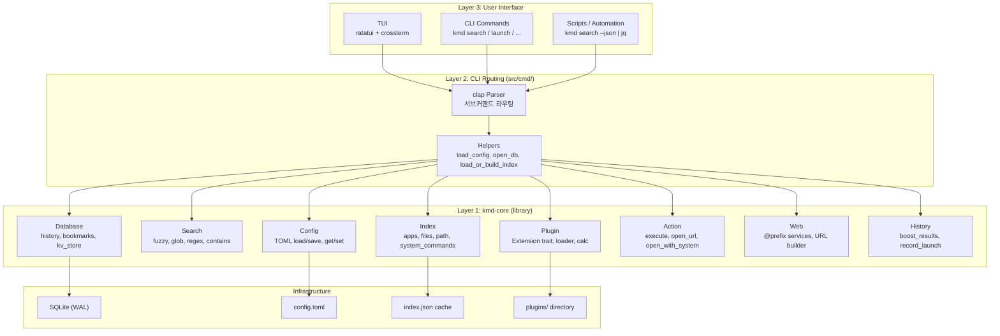
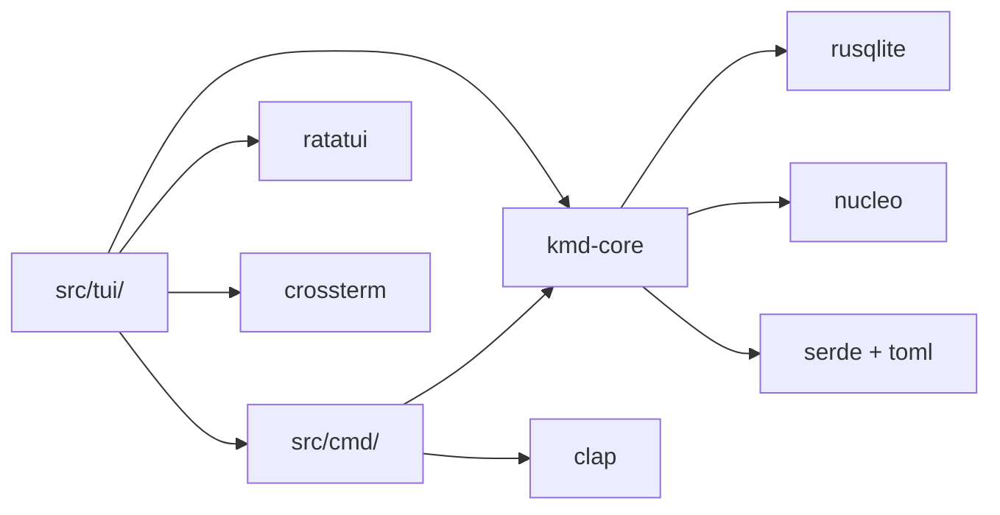
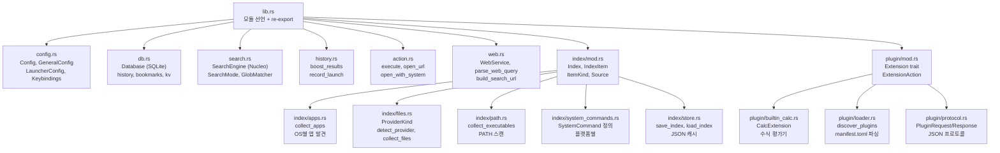
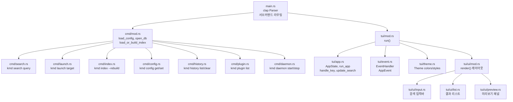
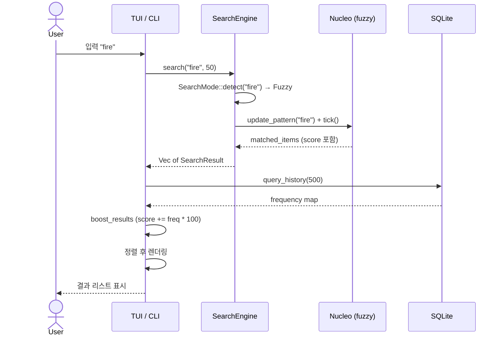
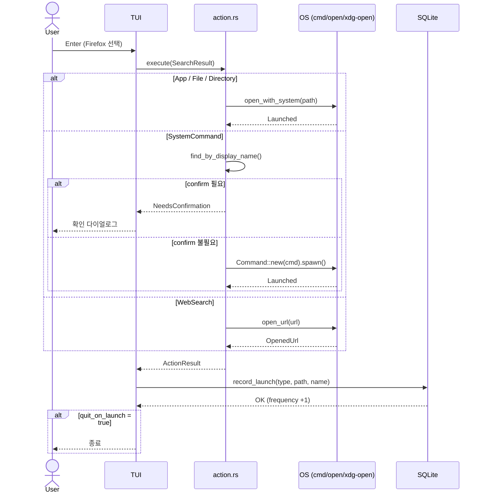
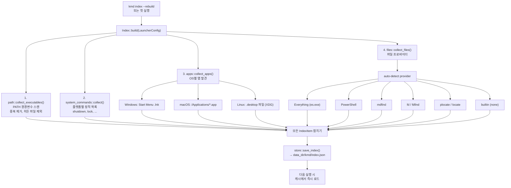
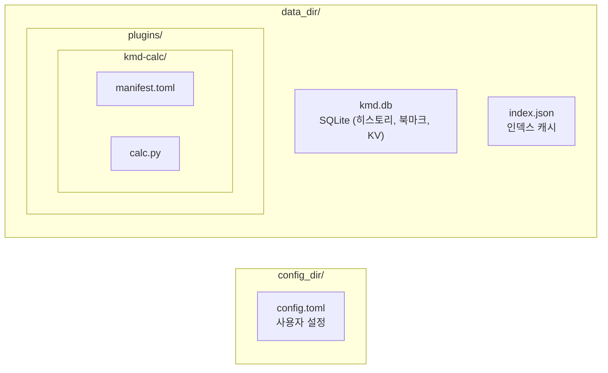
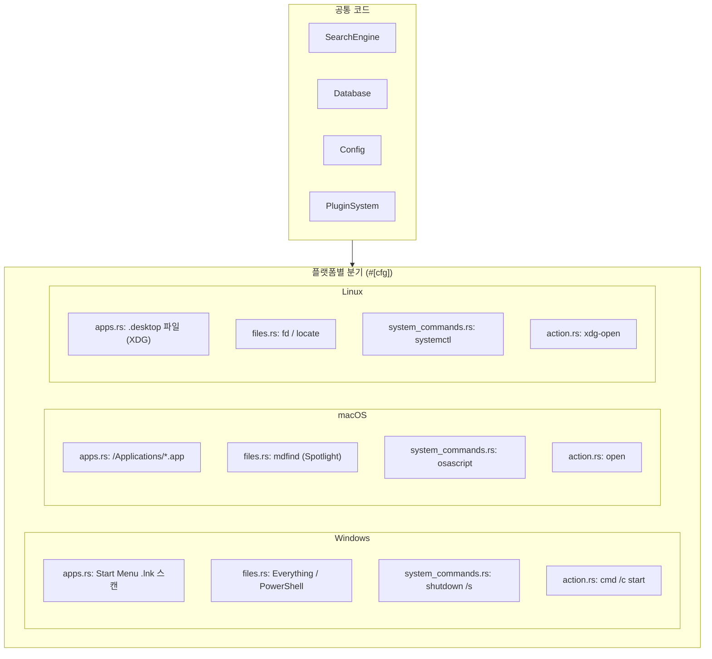
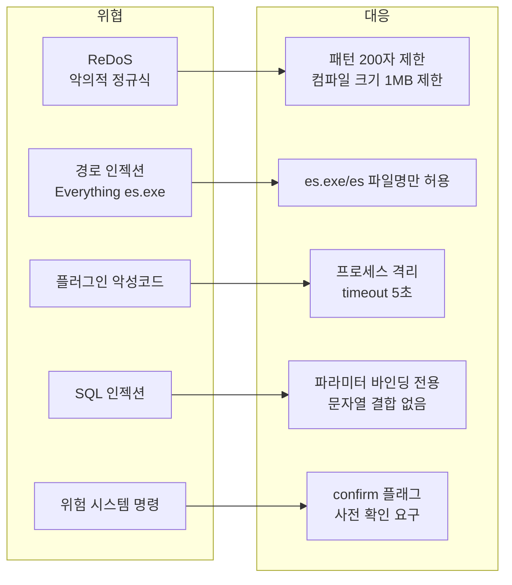

# Architecture Document

## 1. 시스템 아키텍처

### 1.1 3-Layer 설계



### 1.2 핵심 원칙

- **kmd-core는 UI를 모른다**: 순수 라이브러리, TUI/CLI 의존성 없음
- **CLI는 얇은 레이어**: clap으로 인자 파싱 후 kmd-core 함수 호출
- **TUI는 프론트엔드**: kmd-core API만 호출, 비즈니스 로직 없음
- **단방향 의존성**: TUI → CLI helpers → kmd-core (역방향 없음)

### 1.3 의존성 방향



---

## 2. 모듈 구조

### 2.1 kmd-core 모듈 맵



### 2.2 바이너리 모듈 맵



---

## 3. 데이터 흐름

### 3.1 검색 흐름



### 3.2 실행 흐름



### 3.3 인덱스 빌드 흐름



### 3.4 TUI 이벤트 루프

```mermaid
stateDiagram-v2
    [*] --> Init: kmd (인자 없음)
    Init --> LoadConfig: load config + index + db
    LoadConfig --> Render: 첫 렌더링

    Render --> WaitEvent: terminal.draw()
    WaitEvent --> HandleKey: Key event
    WaitEvent --> Render: Tick / Resize

    HandleKey --> Quit: Ctrl+C / Esc (빈 쿼리)
    HandleKey --> ClearQuery: Esc (쿼리 있음)
    HandleKey --> Navigate: Up / Down
    HandleKey --> TogglePreview: Ctrl+P
    HandleKey --> Execute: Enter
    HandleKey --> UpdateSearch: 문자 입력 / Backspace

    ClearQuery --> ShowHistory: 히스토리 로드
    ShowHistory --> Render
    Navigate --> Render
    TogglePreview --> Render
    UpdateSearch --> SearchEngine: engine.search()
    SearchEngine --> BoostResults: history boost
    BoostResults --> Render
    Execute --> ActionExecute: action::execute()
    ActionExecute --> RecordHistory: DB 기록

    RecordHistory --> Quit: quit_on_launch
    RecordHistory --> Render: 계속

    Quit --> [*]: 터미널 복원
```

---

## 4. 파일 시스템 레이아웃

### 4.1 설정/데이터 디렉토리

| OS | Config | Data |
|----|--------|------|
| Linux | `~/.config/kmd/` | `~/.local/share/kmd/` |
| macOS | `~/Library/Application Support/kmd/` | 동일 |
| Windows | `%APPDATA%/kmd/` | `%LOCALAPPDATA%/kmd/` |

### 4.2 파일 구조



---

## 5. 기술 스택

| 역할 | 기술 | 선택 이유 |
|------|------|----------|
| 언어 | Rust 2021 | 단일 바이너리, 크로스컴파일, 메모리 안전 |
| TUI | Ratatui 0.29 + Crossterm 0.28 | 가장 성숙한 Rust TUI, 크로스플랫폼 터미널 |
| 퍼지 검색 | Nucleo 0.5 | helix editor와 동일, 빠르고 정확 |
| DB | rusqlite 0.32 (bundled) | 외부 의존성 없는 SQLite, WAL 지원 |
| CLI | clap 4 (derive) | Rust 표준 CLI 파서 |
| 설정 | serde + toml 0.8 | 사람이 읽기 쉬운 포맷 |
| 비동기 | tokio 1 | TUI 이벤트 루프용 |
| 에러 | color-eyre 0.6 + thiserror 2 | 사용자 친화적 에러 메시지 |
| 로깅 | tracing 0.1 | 구조적 로깅, 환경변수 필터 |
| 파일 탐색 | walkdir 2 | 내장 파일 스캔 폴백용 |

---

## 6. 크로스플랫폼 전략

### 6.1 플랫폼별 분기 맵



### 6.2 Crossterm 이벤트 처리

Windows에서 Crossterm은 KeyPress + KeyRelease 이벤트를 모두 발생시킨다.
중복 방지를 위해 `KeyEventKind::Press`만 처리:

```rust
if key.kind == KeyEventKind::Press {
    Ok(AppEvent::Key(key))
}
```

---

## 7. 보안 고려사항


