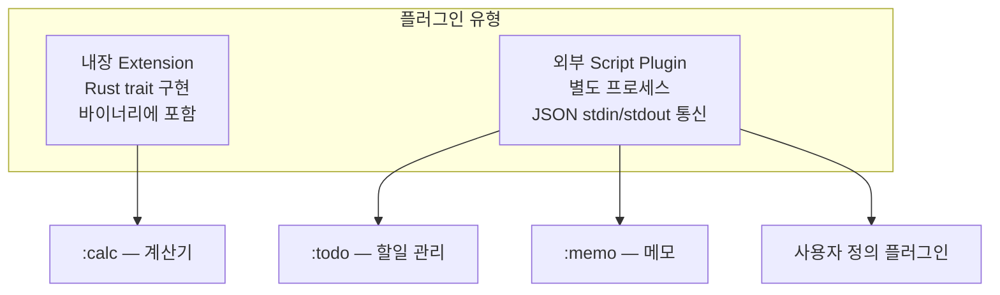
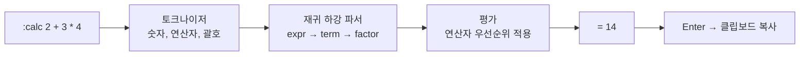
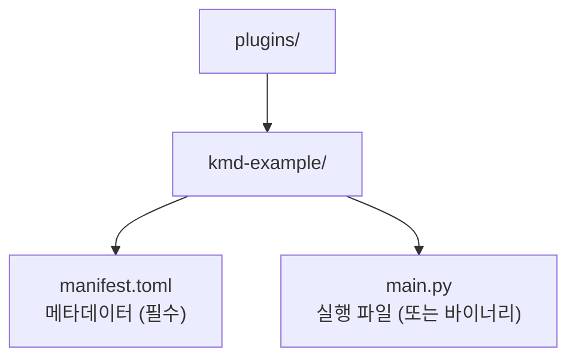
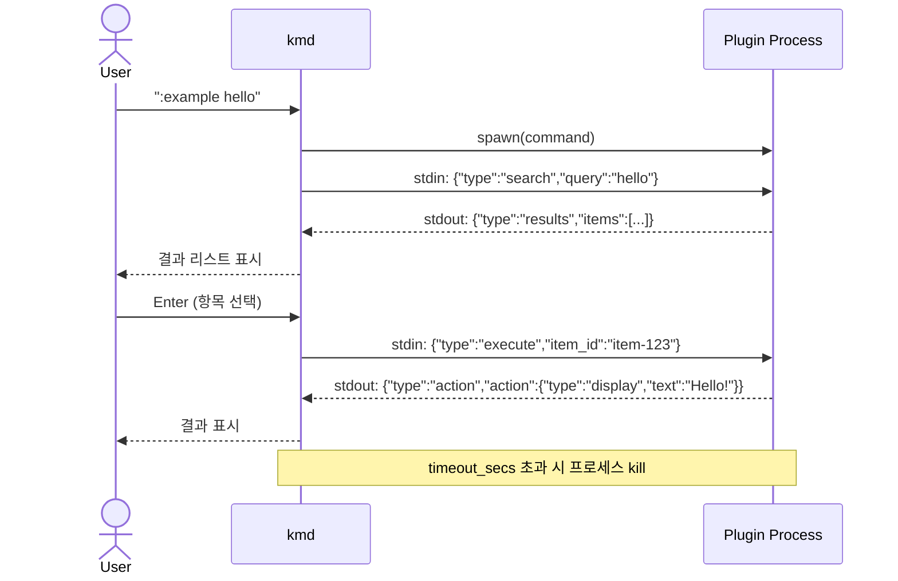
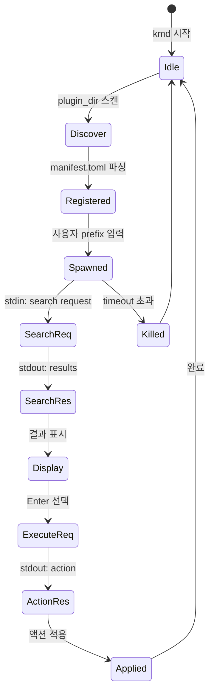
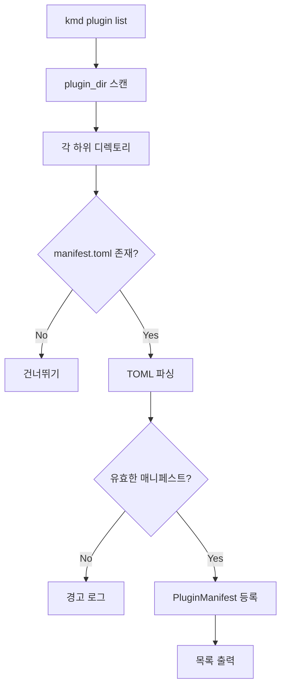

# Plugin System Specification

## 1. 개요

keymander 플러그인은 두 가지 형태로 존재한다:



---

## 2. Extension Trait (내장 플러그인)

### 2.1 인터페이스

```rust
pub trait Extension: Send + Sync {
    /// 플러그인 이름
    fn name(&self) -> &str;

    /// 활성화 prefix (e.g. ":calc", ":todo")
    /// None이면 글로벌 검색에 참여
    fn prefix(&self) -> Option<&str>;

    /// 검색 결과 반환
    fn search(&self, query: &str) -> Vec<IndexItem>;

    /// 선택 항목 실행
    fn execute(&self, item: &IndexItem) -> ExtensionAction;
}

pub enum ExtensionAction {
    Display(String),          // 결과 표시
    CopyToClipboard(String),  // 클립보드 복사
    OpenUrl(String),          // URL 열기
    Noop,                     // 아무것도 안 함
}
```

### 2.2 내장 플러그인: Calculator



지원 연산:

| 연산자 | 의미 | 예시 |
|--------|------|------|
| `+` | 덧셈 | `2 + 3` → `5` |
| `-` | 뺄셈 / 단항 마이너스 | `10 - 3` → `7`, `-5` → `-5` |
| `*` | 곱셈 | `4 * 5` → `20` |
| `/` | 나눗셈 | `15 / 3` → `5` |
| `%` | 나머지 | `10 % 3` → `1` |
| `()` | 그룹 | `(2 + 3) * 4` → `20` |

---

## 3. Script Plugin (외부 플러그인)

### 3.1 디렉토리 구조



### 3.2 manifest.toml

```toml
name = "kmd-example"
version = "0.1.0"
description = "An example plugin"
prefix = ":example"          # 활성화 prefix
command = "python main.py"   # 실행 명령 (플러그인 디렉토리 기준)
timeout_secs = 5             # 타임아웃 (기본 5초, 최대 30초)
```

### 3.3 통신 프로토콜



#### Request (kmd → plugin, stdin JSON)

```json
{"type": "search", "query": "hello world"}
```

```json
{"type": "execute", "item_id": "item-123"}
```

#### Response (plugin → kmd, stdout JSON)

```json
{
  "type": "results",
  "items": [
    {
      "id": "item-123",
      "name": "Hello World",
      "description": "A greeting",
      "icon": "👋"
    }
  ]
}
```

```json
{
  "type": "action",
  "action": {"type": "copy", "text": "copied text"}
}
```

### 3.4 생명주기



### 3.5 보안

| 정책 | 내용 |
|------|------|
| 프로세스 격리 | 각 플러그인은 별도 프로세스로 실행 |
| 타임아웃 | 기본 5초, manifest에서 최대 30초 설정 가능 |
| 환경 | 플러그인 디렉토리를 CWD로 설정, 최소 환경변수 전달 |
| 파일시스템 | 별도 샌드박스 없음 (사용자 책임) |

---

## 4. 플러그인 관리

### 4.1 CLI

```bash
kmd plugin list              # 설치된 플러그인 목록
# (향후)
kmd plugin install <name>    # 플러그인 설치
kmd plugin remove <name>     # 플러그인 제거
kmd plugin update <name>     # 플러그인 업데이트
```

### 4.2 디스커버리 흐름



기본 디렉토리:
- Linux: `~/.local/share/kmd/plugins/`
- macOS: `~/Library/Application Support/kmd/plugins/`
- Windows: `%LOCALAPPDATA%/kmd/plugins/`

---

## 5. 향후 계획

### 5.1 예정 공식 플러그인

| 이름 | Prefix | 기능 |
|------|--------|------|
| kmd-todo | `:todo` | 할일 관리 (SQLite) |
| kmd-memo | `:memo` | 메모 관리 (SQLite) |
| kmd-clipboard | `:clip` | 클립보드 히스토리 |
| kmd-snippet | `:snip` | 텍스트 스니펫 확장 |

### 5.2 플러그인 레지스트리

향후 중앙 레지스트리 도입 가능:
- `kmd plugin install kmd-todo` → GitHub 릴리스에서 다운로드
- `manifest.toml`에 `repository` 필드 추가
- 버전 관리 및 업데이트 알림
