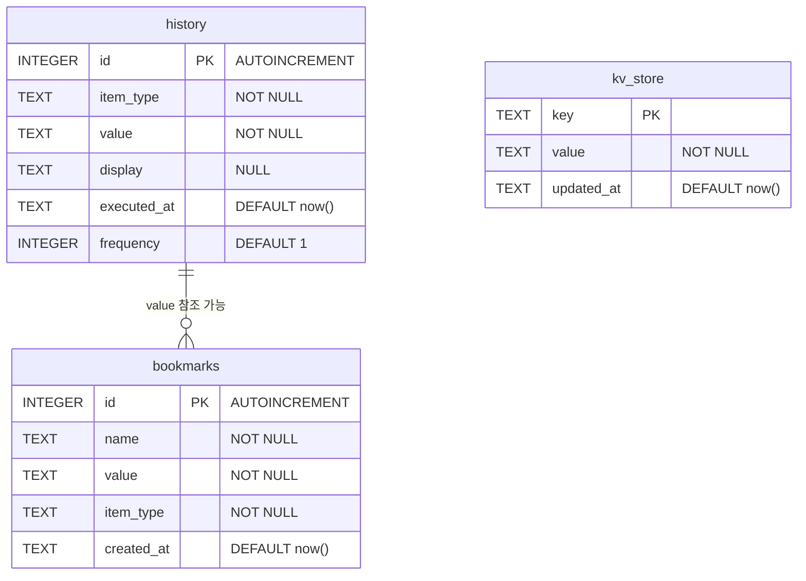
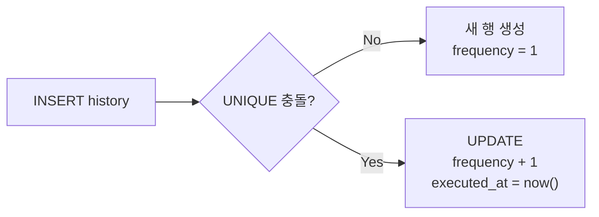
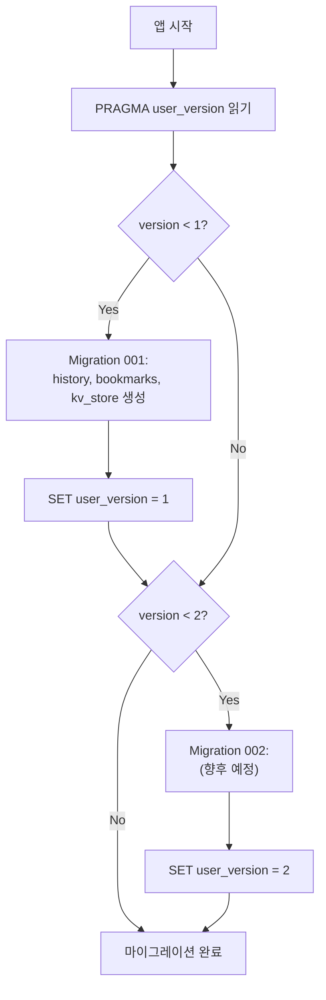
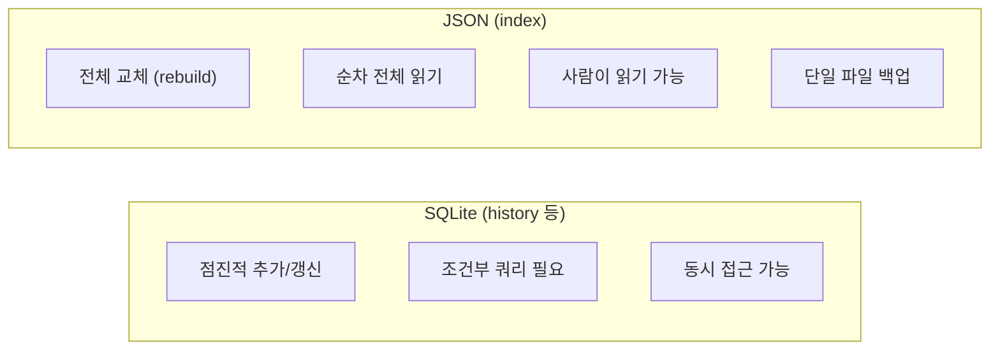

# Database Schema Specification

## 1. 개요

keymander는 SQLite를 번들(rusqlite bundled)하여 외부 의존성 없이 데이터를 저장한다.

- **파일**: `{data_dir}/kmd/kmd.db`
- **모드**: WAL (Write-Ahead Logging) — 동시 읽기/쓰기 성능 최적화
- **마이그레이션**: `PRAGMA user_version` 기반 순차 실행

---

## 2. ER 다이어그램



---

## 3. 테이블 상세

### 3.1 history — 실행 이력

사용빈도 기반 검색 결과 부스팅의 핵심 데이터.

```sql
CREATE TABLE history (
    id          INTEGER PRIMARY KEY AUTOINCREMENT,
    item_type   TEXT    NOT NULL,           -- "App", "File", "Exe", "System", "Web"
    value       TEXT    NOT NULL,           -- 실행 경로 또는 URL
    display     TEXT,                       -- 표시명 (NULL이면 value 사용)
    executed_at TEXT    NOT NULL DEFAULT (strftime('%Y-%m-%dT%H:%M:%SZ', 'now')),
    frequency   INTEGER NOT NULL DEFAULT 1  -- 누적 실행 횟수
);

CREATE UNIQUE INDEX idx_history_unique ON history(item_type, value);
```

**Upsert 동작**:



```sql
INSERT INTO history(item_type, value, display, frequency)
VALUES (?1, ?2, ?3, 1)
ON CONFLICT(item_type, value) DO UPDATE SET
  frequency = frequency + 1,
  display = COALESCE(?3, display),
  executed_at = strftime('%Y-%m-%dT%H:%M:%SZ', 'now')
```

### 3.2 bookmarks — 즐겨찾기

사용자가 고정한 항목. 향후 TUI에서 별표/핀 기능으로 사용.

```sql
CREATE TABLE bookmarks (
    id          INTEGER PRIMARY KEY AUTOINCREMENT,
    name        TEXT    NOT NULL,
    value       TEXT    NOT NULL,           -- 경로 또는 URL
    item_type   TEXT    NOT NULL,
    created_at  TEXT    NOT NULL DEFAULT (strftime('%Y-%m-%dT%H:%M:%SZ', 'now'))
);
```

### 3.3 kv_store — 키-값 저장소

임의의 메타데이터 저장. 플러그인 상태, 캐시 타임스탬프 등.

```sql
CREATE TABLE kv_store (
    key        TEXT PRIMARY KEY,
    value      TEXT NOT NULL,
    updated_at TEXT NOT NULL DEFAULT (strftime('%Y-%m-%dT%H:%M:%SZ', 'now'))
);
```

---

## 4. 마이그레이션

### 4.1 전략



### 4.2 버전 이력

| 버전 | 내용 |
|------|------|
| 0 | 초기 상태 (빈 DB) |
| 1 | history, bookmarks, kv_store 테이블 생성 |

### 4.3 향후 마이그레이션 예시

```rust
// Version 2: 플러그인 데이터 테이블
if version < 2 {
    conn.execute_batch("
        CREATE TABLE IF NOT EXISTS plugin_data (
            plugin_name TEXT NOT NULL,
            key         TEXT NOT NULL,
            value       TEXT NOT NULL,
            updated_at  TEXT NOT NULL DEFAULT (strftime('%Y-%m-%dT%H:%M:%SZ', 'now')),
            PRIMARY KEY (plugin_name, key)
        );
    ")?;
    conn.pragma_update(None, "user_version", 2)?;
}
```

---

## 5. 인덱스 캐시 (JSON)

인덱스는 SQLite가 아닌 JSON 파일로 저장된다.

### 5.1 왜 JSON인가?



### 5.2 파일 구조

**파일**: `{data_dir}/kmd/index.json`

```json
{
  "items": [
    {
      "name": "Firefox",
      "path": "C:\\Program Files\\Mozilla Firefox\\firefox.exe",
      "kind": "App",
      "source": "Apps",
      "icon": "📦",
      "keywords": "firefox browser web"
    }
  ],
  "last_updated": "1707600000"
}
```

---

## 6. 데이터 접근 패턴

### 6.1 읽기 패턴

| 함수 | 쿼리 | 빈도 |
|------|------|------|
| `query_history(limit)` | ORDER BY frequency DESC, executed_at DESC | TUI 시작 시 |
| `search_history(query)` | WHERE value LIKE ? OR display LIKE ? | 검색 시 |
| `query_bookmarks()` | ORDER BY created_at DESC | TUI 시작 시 |
| `kv_get(key)` | WHERE key = ? | 필요 시 |

### 6.2 쓰기 패턴

| 함수 | 동작 | 빈도 |
|------|------|------|
| `record_launch()` | UPSERT (frequency+1) | 실행할 때마다 |
| `clear_history()` | DELETE FROM history | 사용자 요청 시 |
| `add_bookmark()` | INSERT OR REPLACE | 사용자 요청 시 |
| `kv_set()` | UPSERT | 필요 시 |

### 6.3 히스토리 부스팅 흐름


