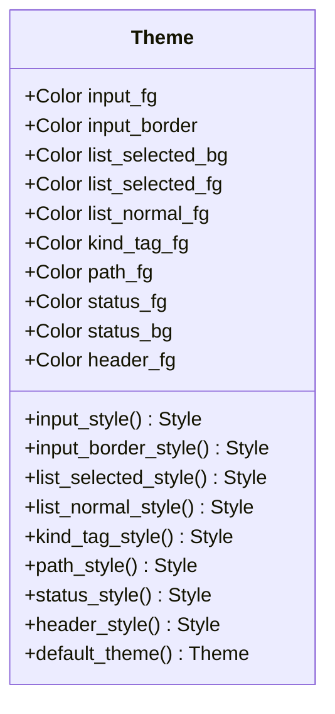
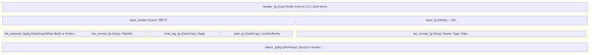
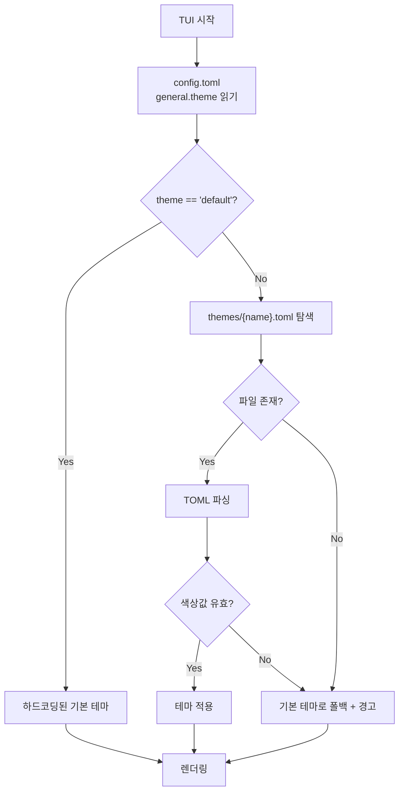
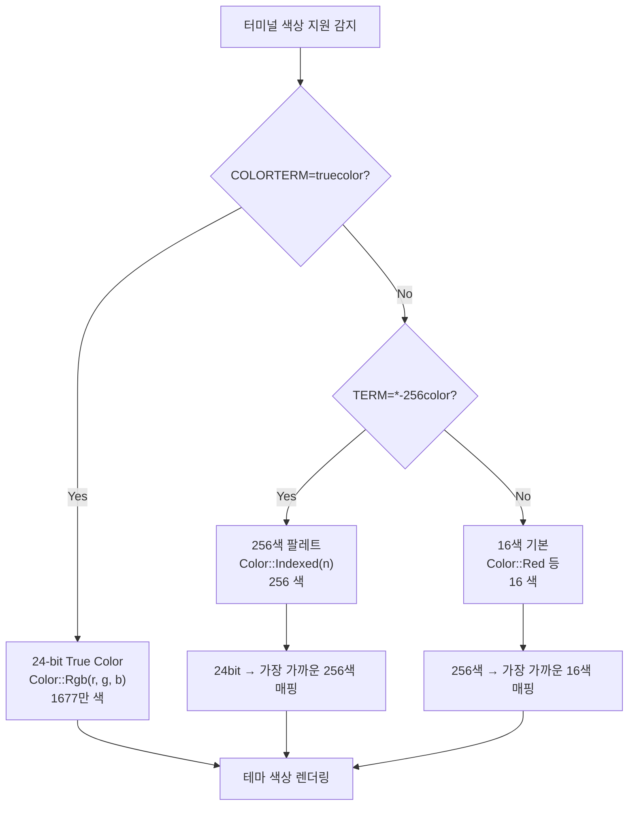
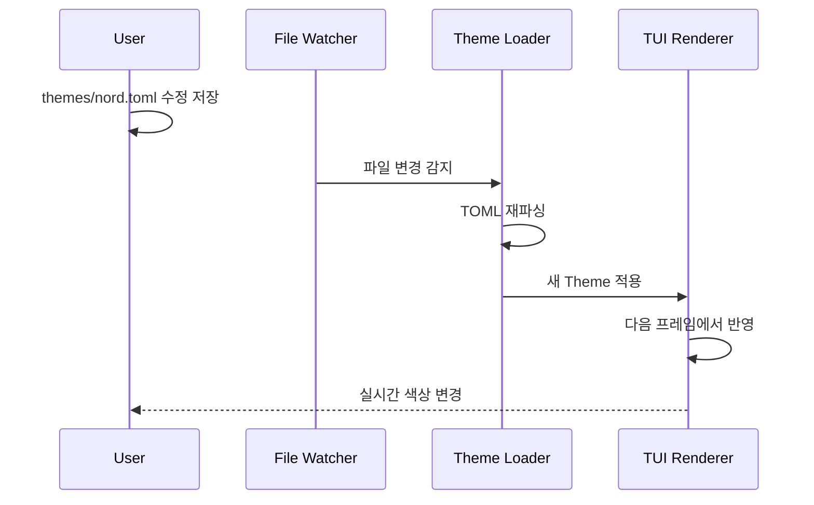
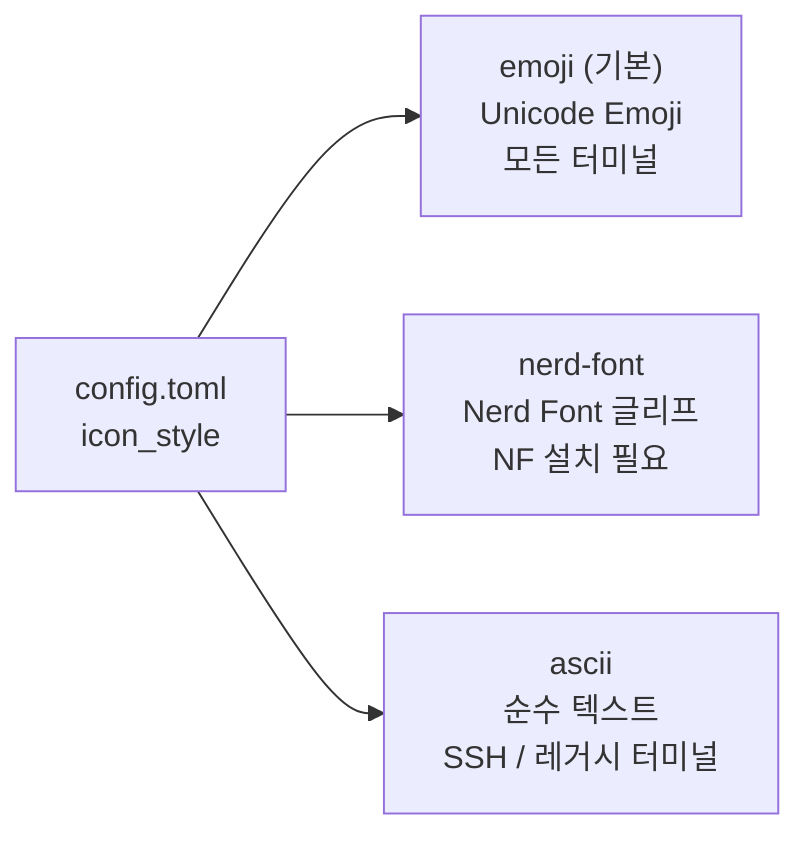

# Theming Specification

## 1. 개요

keymander TUI의 색상과 스타일을 커스터마이즈하는 시스템.
현재는 코드 내장 테마를 사용하며, 향후 TOML 기반 외부 테마 파일을 지원할 예정.

---

## 2. 현재 구현 (v0.2)

### 2.1 Theme 구조체



### 2.2 테마가 적용되는 영역



### 2.3 기본 테마 값

| 요소 | 색상 | 수정자 |
|------|------|--------|
| input_fg | White | — |
| input_border | Cyan | — |
| list_selected_bg | DarkGray | — |
| list_selected_fg | White | Bold |
| list_normal_fg | Gray | — |
| kind_tag_fg | DarkGray | — |
| path_fg | DarkGray | — |
| status_fg | DarkGray | — |
| status_bg | Reset | — |
| header_fg | Cyan | Bold |

---

## 3. 향후 계획 (v0.3+)

### 3.1 TOML 테마 파일

```toml
# ~/.config/kmd/themes/catppuccin-mocha.toml

[meta]
name = "Catppuccin Mocha"
author = "catppuccin"

[colors]
input_fg = "#CDD6F4"        # Text
input_border = "#89B4FA"     # Blue
list_selected_bg = "#45475A" # Surface1
list_selected_fg = "#CDD6F4" # Text
list_normal_fg = "#BAC2DE"   # Subtext1
kind_tag_fg = "#6C7086"      # Overlay0
path_fg = "#6C7086"          # Overlay0
status_fg = "#585B70"        # Surface2
status_bg = "#1E1E2E"        # Base
header_fg = "#89B4FA"        # Blue
```

### 3.2 테마 로드 흐름



### 3.3 예정 테마

| 이름 | 설명 | 계열 |
|------|------|------|
| default | 터미널 기본 색상 활용 | 범용 |
| catppuccin-mocha | 따뜻한 다크 테마 | Dark |
| catppuccin-latte | 밝은 라이트 테마 | Light |
| nord | 차가운 파란 계열 | Dark |
| tokyo-night | VS Code 인기 테마 포트 | Dark |
| gruvbox | 레트로 컬러 | Dark |
| solarized-dark | 클래식 다크 테마 | Dark |

### 3.4 색상 시스템



### 3.5 테마 핫 리로드 (향후)



---

## 4. 아이콘 시스템

### 4.1 현재 구현 (Unicode Emoji)

Nerd Font에 의존하지 않고 Unicode 이모지 사용:

| 확장자/종류 | 아이콘 | | 확장자/종류 | 아이콘 |
|-------------|--------|-|-------------|--------|
| .rs | 🦀 | | .json/.yaml/.toml | 📋 |
| .py | 🐍 | | 이미지 | 🖼️ |
| .js/.ts | 📜 | | 음악 | 🎵 |
| .go | 🔵 | | 동영상 | 🎬 |
| .java/.kt | ☕ | | 압축파일 | 📦 |
| .c/.cpp | ⚙️ | | 디렉토리 | 📁 |
| .sh/.bash | 🐚 | | 실행파일 | ⚡ |
| .md/.txt/.doc | 📝 | | 히스토리 | 🕒 |
| .pdf | 📕 | | 기타 | 📄 |

### 4.2 향후: 아이콘 스타일 선택



config.toml:
```toml
[general]
icon_style = "emoji"      # 기본값
# icon_style = "nerd-font"
# icon_style = "ascii"
```
