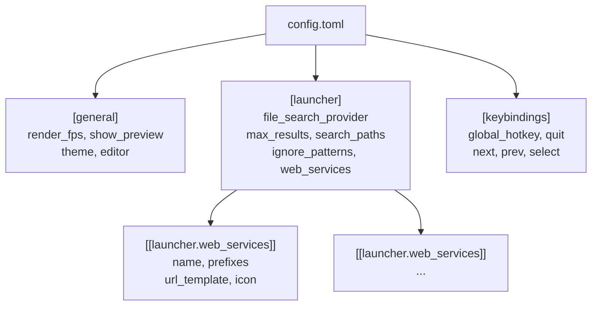
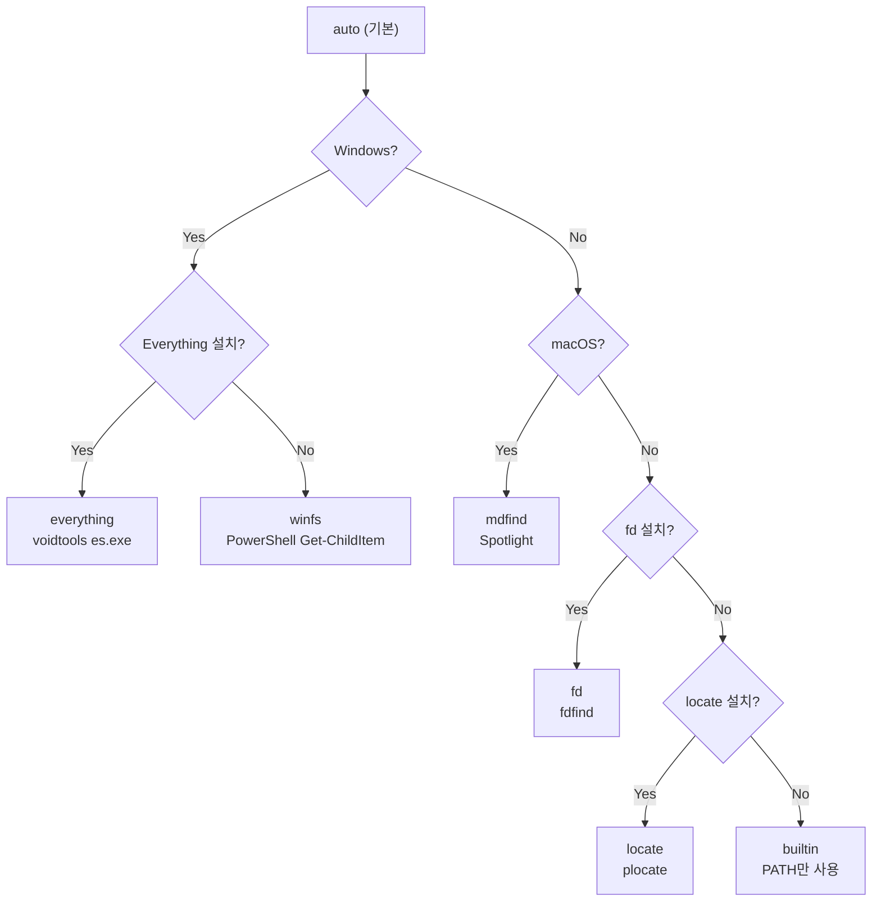
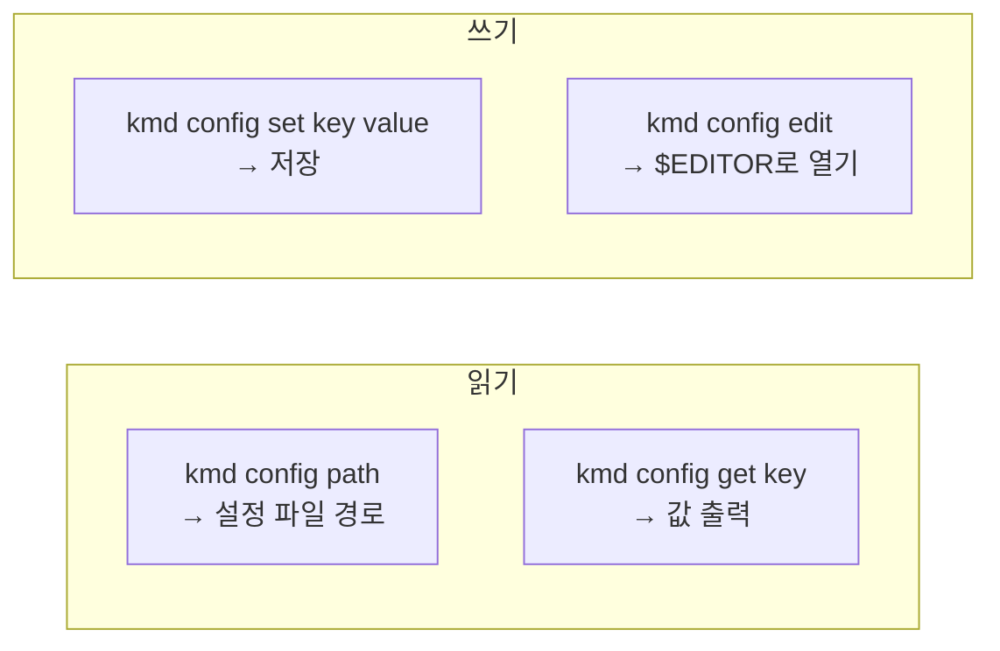
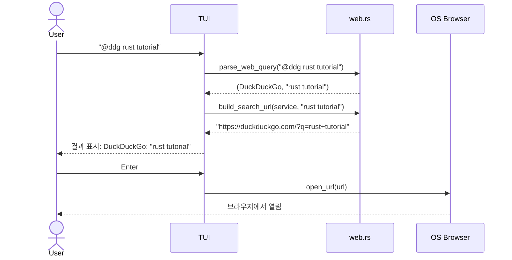

# Configuration Reference

## 1. 파일 위치

| OS | 경로 |
|----|------|
| Linux | `~/.config/kmd/config.toml` |
| macOS | `~/Library/Application Support/kmd/config.toml` |
| Windows | `%APPDATA%/kmd/config.toml` |

확인: `kmd config path`

---

## 2. 설정 구조 개요



---

## 3. 전체 기본 설정

```toml
[general]
render_fps = 30              # TUI 렌더링 FPS
show_preview = true          # 미리보기 패널 표시 여부
preview_width_percent = 40   # 미리보기 패널 너비 (%)
theme = "default"            # 테마 이름
# editor = "code"            # 외부 에디터 (미설정 시 $EDITOR → vi/notepad)

[launcher]
file_search_provider = "auto"     # 파일 검색 프로바이더
# everything_path = "C:\\Program Files\\Everything\\es.exe"
search_paths = []                 # 검색 디렉토리 (빈 배열 = 홈 디렉토리)
max_results = 5000                # 파일 프로바이더 최대 결과 수
ignore_patterns = [".git", "node_modules", "target", "__pycache__"]
quit_on_launch = false            # 실행 후 kmd 자동 종료

# 커스텀 웹 서비스 예시
# [[launcher.web_services]]
# name = "DuckDuckGo"
# prefixes = ["@ddg", "@duck"]
# icon = "🦆"
# url_template = "https://duckduckgo.com/?q={query}"
# description = "DuckDuckGo 검색"

[keybindings]
global_hotkey = "alt+space"       # 데몬 글로벌 핫키
quit = "ctrl+c"
next = "down"
prev = "up"
select = "enter"
toggle_preview = "ctrl+p"
```

---

## 4. 설정 항목 상세

### 4.1 [general]

| 키 | 타입 | 기본값 | 설명 |
|----|------|--------|------|
| render_fps | u64 | 30 | TUI 렌더링 FPS (1-60) |
| show_preview | bool | true | 미리보기 패널 표시 |
| preview_width_percent | u16 | 40 | 미리보기 너비 비율 (20-80) |
| theme | String | "default" | 테마 이름 |
| editor | String? | None | 외부 에디터 ($EDITOR 폴백) |

### 4.2 [launcher]

| 키 | 타입 | 기본값 | 설명 |
|----|------|--------|------|
| file_search_provider | String | "auto" | 파일 검색 백엔드 |
| everything_path | Path? | None | es.exe 경로 (Windows) |
| search_paths | Vec\<Path\> | [] | 검색 대상 디렉토리 |
| max_results | usize | 5000 | 최대 결과 수 |
| ignore_patterns | Vec\<String\> | [".git", ...] | 무시 패턴 |
| quit_on_launch | bool | false | 실행 후 종료 |
| web_services | Vec\<WebService\> | [] | 커스텀 웹 서비스 |

### 4.3 file_search_provider 자동 감지



| 값 | 설명 | 플랫폼 |
|----|------|--------|
| `auto` | 자동 감지 (위 우선순위) | 전체 |
| `builtin` | 파일 검색 비활성화 (PATH만) | 전체 |
| `fd` | fd / fdfind | 전체 (설치 필요) |
| `everything` | voidtools Everything (es.exe) | Windows |
| `winfs` | PowerShell Get-ChildItem | Windows |
| `mdfind` | Spotlight (mdfind) | macOS |
| `locate` | plocate / mlocate | Linux |

### 4.4 [keybindings]

| 키 | 기본값 | 설명 |
|----|--------|------|
| global_hotkey | alt+space | 데몬 핫키 |
| quit | ctrl+c | 종료 |
| next | down | 다음 항목 |
| prev | up | 이전 항목 |
| select | enter | 선택/실행 |
| toggle_preview | ctrl+p | 미리보기 토글 |

---

## 5. CLI 설정 관리



```bash
# 설정 파일 경로 확인
kmd config path
# → C:\Users\user\AppData\Roaming\kmd\config.toml

# 값 조회
kmd config get general.theme
# → default

# 값 설정
kmd config set launcher.quit_on_launch true
# → Set launcher.quit_on_launch = true

# 에디터로 직접 편집
kmd config edit
# → notepad/vi/$EDITOR로 config.toml 열기
```

---

## 6. 커스텀 웹 서비스

config.toml에 `[[launcher.web_services]]` 배열로 추가:

```toml
[[launcher.web_services]]
name = "DuckDuckGo"
prefixes = ["@ddg", "@duck"]
icon = "🦆"
url_template = "https://duckduckgo.com/?q={query}"
description = "DuckDuckGo 검색"

[[launcher.web_services]]
name = "MDN"
prefixes = ["@mdn"]
icon = "📗"
url_template = "https://developer.mozilla.org/search?q={query}"
description = "MDN Web Docs 검색"
```

`{query}` 자리에 검색어가 URL 인코딩되어 삽입됨.

### 6.1 웹 서비스 사용 흐름



---

## 7. 환경변수

| 변수 | 설명 |
|------|------|
| `KMD_CONFIG_DIR` | 설정 디렉토리 오버라이드 (향후) |
| `KMD_DATA_DIR` | 데이터 디렉토리 오버라이드 (향후) |
| `EDITOR` / `VISUAL` | `kmd config edit`에서 사용할 에디터 |
| `RUST_LOG` | 로깅 레벨 (e.g. `kmd_core=debug`) |
