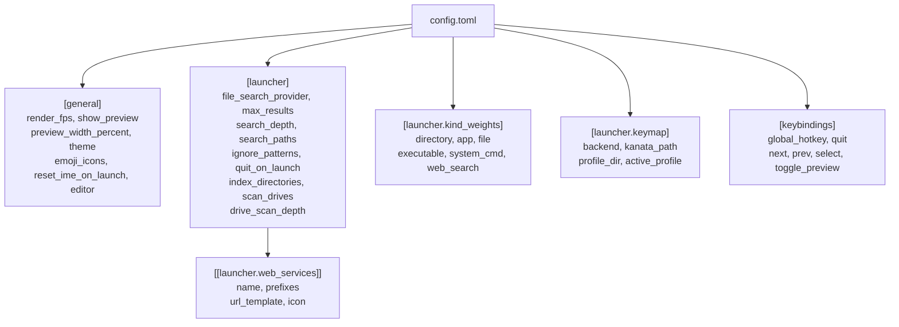
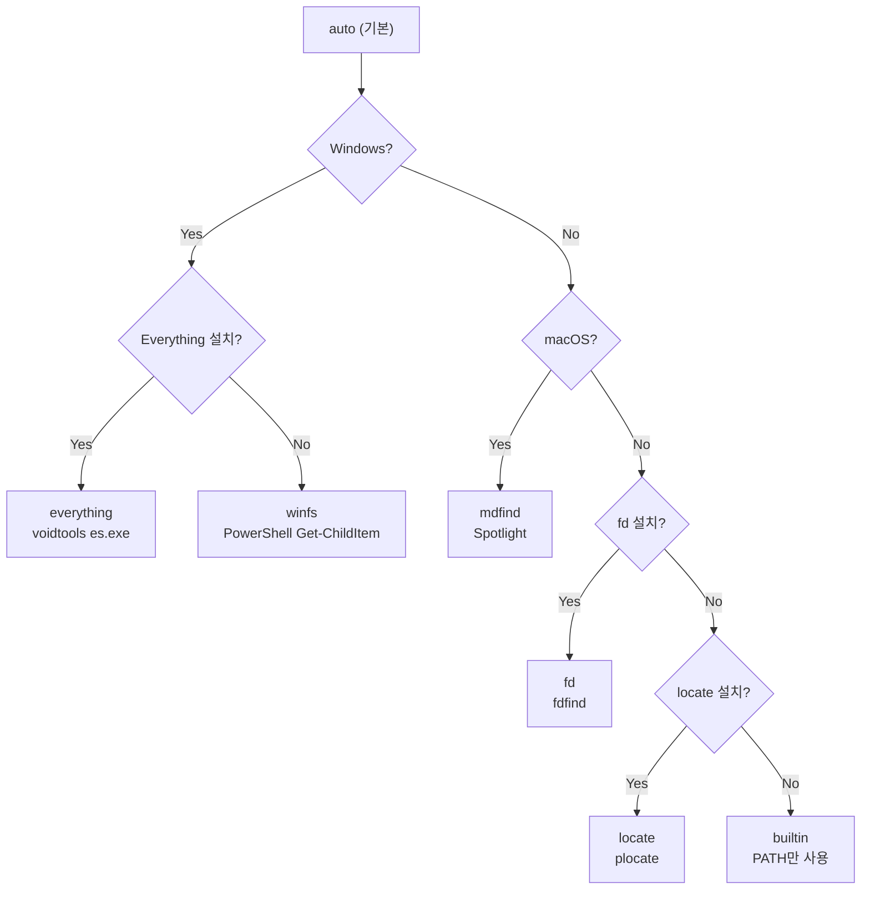
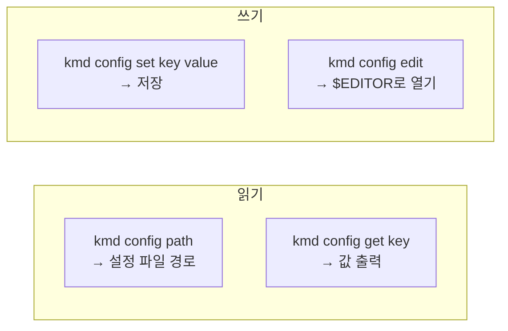
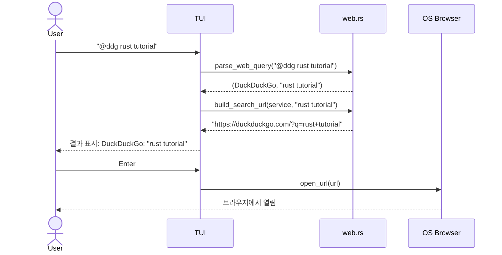

# Configuration Reference

## 1. 파일 위치

| OS | 경로 |
|----|------|
| Linux | `~/.config/kmd/config.toml` |
| macOS | `~/Library/Application Support/kmd/config.toml` |
| Windows | `%APPDATA%/kmd/config.toml` |

확인: `kmd config path`

---

## 2. 설정 구조 개요



> TUI에서 **F2** 키를 눌러 설정 모달에서 대화형으로 편집할 수 있습니다.

---

## 3. 전체 기본 설정

```toml
[general]
render_fps = 30              # TUI 렌더링 FPS
show_preview = true          # 미리보기 패널 표시 여부
preview_width_percent = 40   # 미리보기 패널 너비 (%)
theme = "default"            # 테마 이름
emoji_icons = true           # 이모지 아이콘 (false = ASCII 폴백)
reset_ime_on_launch = true   # (Desktop) 실행 시 IME를 영문 모드로 시작
renderer = "auto"            # (Desktop) auto | software | gpu — VM/원격 데스크톱은 software 권장
brand_icons = "color"        # (Desktop) color = 풀컬러 로고 | mono = 테마 틴트 단색 글리프
# editor = "code"            # 외부 에디터 (미설정 시 $EDITOR → vi/notepad)

[launcher]
file_search_provider = "auto"     # 파일 검색 프로바이더
# everything_path = "C:\\Program Files\\Everything\\es.exe"
# search_paths = []              # 검색 디렉토리 (기본: 플랫폼별 사용자 폴더)
max_results = 5000                # 파일 프로바이더 최대 결과 수
search_depth = 4                  # 최대 재귀 탐색 깊이
ignore_patterns = [".git", "node_modules", "target", "__pycache__", "Windows", "Program Files"]
quit_on_launch = true             # 실행 후 kmd 자동 종료
index_directories = true          # 폴더도 인덱스에 포함
scan_drives = false               # 드라이브 루트 자동 스캔 (C:\, D:\ 등)
drive_scan_depth = 2              # 드라이브 루트 스캔 깊이

# 검색 결과 우선순위 가중치 (0-100, 높을수록 상위 노출)
[launcher.kind_weights]
directory = 80
app = 70
file = 50
executable = 40
system_cmd = 30
web_search = 20

# 커스텀 웹 서비스 예시
# [[launcher.web_services]]
# name = "DuckDuckGo"
# prefixes = ["@ddg", "@duck"]
# icon = "🦆"
# url_template = "https://duckduckgo.com/?q={query}"
# description = "DuckDuckGo 검색"

[keybindings]
global_hotkey = "alt+space"       # 데몬 글로벌 핫키
toggle_keymap = "ctrl+alt+k"      # daemon keymap on/off
quit = "ctrl+c"
next = "down"
prev = "up"
select = "enter"
toggle_preview = "ctrl+p"
```

---

## 4. 설정 항목 상세

### 4.1 [general]

| 키 | 타입 | 기본값 | 설명 |
|----|------|--------|------|
| render_fps | u64 | 30 | TUI 렌더링 FPS (1-60) |
| show_preview | bool | true | 미리보기 패널 표시 |
| preview_width_percent | u16 | 40 | 미리보기 너비 비율 (20-80) |
| theme | String | "default" | 테마 이름 |
| emoji_icons | bool | true | 이모지 아이콘 (false = ASCII 폴백) |
| reset_ime_on_launch | bool | true | (Desktop) 런처 오픈 시 IME를 영문 모드로 시작 |
| renderer | String | "auto" | (Desktop) 렌더러 선택. `software`는 GPU 어댑터 프로빙을 생략하고 tiny-skia로 직행 — VM·원격 데스크톱·가상 GPU 환경에서 부팅이 빨라지고 입력 지연이 줄 수 있다. `gpu`는 wgpu 강제. 환경변수 `ICED_BACKEND`가 설정돼 있으면 그쪽이 우선 |
| brand_icons | String | "color" | (Desktop) 브랜드 아이콘 스타일. `color`는 공식 풀컬러 로고 PNG, `mono`는 Simple Icons 단색 글리프를 테마 teal로 틴트해 시스템 아이콘과 톤을 통일. `:set`의 "Brand Icons" 토글과 동일. 글리프 없는 서비스(grok/daum/papago)는 시스템 아이콘으로 폴백 |
| editor | String? | None | 외부 에디터 ($EDITOR 폴백) |

### 4.2 [launcher]

| 키 | 타입 | 기본값 | 설명 |
|----|------|--------|------|
| file_search_provider | String | "auto" | 파일 검색 백엔드 |
| everything_path | Path? | None | es.exe 경로 (Windows) |
| search_paths | Vec\<Path\> | 플랫폼별 | 검색 대상 디렉토리 (기본: Desktop, Documents, Downloads 등) |
| max_results | usize | 5000 | 최대 인덱스 항목 수 |
| search_depth | usize | 4 | 최대 재귀 디렉토리 탐색 깊이 |
| ignore_patterns | Vec\<String\> | [".git", ...] | 무시 패턴 |
| quit_on_launch | bool | true | 실행 후 kmd 종료 (런처 모드) |
| index_directories | bool | true | 폴더를 검색 인덱스에 포함 |
| scan_drives | bool | false | 드라이브 루트 자동 스캔 |
| drive_scan_depth | usize | 2 | 드라이브 루트 스캔 깊이 |
| web_services | Vec\<WebService\> | [] | 커스텀 웹 서비스 |
| multi_llm_providers | Vec\<String\> | chatgpt,claude,… | `@llm` 대상 LLM |
| multi_llm_prefixes | Vec\<String\> | @llm,@ll,… | `@llm` 별칭 |
| llm_autopilot | bool | false | LLM 자동 제출(데몬 키 주입, Windows). `@gpt`/`@claude`는 Enter, `@gemini`는 붙여넣기+Enter를 전경창 검증 후 주입. `@@ <질문>`으로 이어서 질문. 자동 키 주입이라 opt-in (docs/09) |

### 4.3 [launcher.kind_weights]

검색 결과 우선순위 가중치 (0-100). 높을수록 검색 결과에서 상위에 노출됩니다.
F2 설정 모달의 **Priority** 탭에서 슬라이더로 조절 가능합니다.

| 키 | 타입 | 기본값 | 설명 |
|----|------|--------|------|
| directory | u32 | 80 | 폴더 우선순위 |
| app | u32 | 70 | 애플리케이션 우선순위 |
| file | u32 | 50 | 파일 우선순위 |
| executable | u32 | 40 | PATH 실행파일 우선순위 |
| system_cmd | u32 | 30 | 시스템 명령 우선순위 |
| web_search | u32 | 20 | 웹 검색 우선순위 |

### 4.4 file_search_provider 자동 감지



| 값 | 설명 | 플랫폼 |
|----|------|--------|
| `auto` | 자동 감지 (위 우선순위) | 전체 |
| `builtin` | 파일 검색 비활성화 (PATH만) | 전체 |
| `fd` | fd / fdfind | 전체 (설치 필요) |
| `everything` | voidtools Everything (es.exe) | Windows |
| `winfs` | PowerShell Get-ChildItem | Windows |
| `mdfind` | Spotlight (mdfind) | macOS |
| `locate` | plocate / mlocate | Linux |

### 4.5 [launcher.keymap]

| 키 | 타입 | 기본값 | 설명 |
|----|------|--------|------|
| backend | String | "kanata" | 키맵 백엔드 (현재 kanata만 지원) |
| kanata_path | Path? | None | kanata 바이너리 경로 (None = PATH에서 탐색) |
| profile_dir | Path? | None | 프로파일 디렉토리 (None = `config_dir/keymap`) |
| active_profile | String | "vim-nav" | 활성 프로파일 이름 |

```toml
[launcher.keymap]
backend = "kanata"
# kanata_path = "C:\\Users\\you\\bin\\kanata.exe"
# profile_dir = "C:\\Users\\you\\.config\\kmd\\keymap"
active_profile = "vim-nav"
```

**내장 프리셋**:
- `vim-nav` — Alt 홀드 → HJKL 네비게이션 + Alt+Space → kmd-desktop 실행
  - CapsLock 모드탭: 짧게 탭 = CapsLock, 홀드 + 다른 키 = Ctrl (HHKB 스타일, Windows)
  - RAlt 홀드 → 마우스 레이어 (아래 참조)
- `minimal` — CapsLock 모드탭: 짧게 탭 = Esc, 홀드 = Ctrl (macOS는 CapsLock → Esc 리맵)

프리셋 설치: `kmd keymap init vim-nav` (또는 `kmd keymap init minimal`)
프리셋 목록: `kmd keymap list-presets`

#### 마우스 레이어 (RAlt 홀드)

홀드 손(오른엄지)과 조작 손(왼손)을 분리한 배치. 짧게 탭하면 한/영 전환이
유지된다 (Windows 한국어 배열의 물리 오른쪽 Alt = 한/영 키).

| 키 | 기능 |
|----|------|
| W / A / S / D | 포인터 ↑ ← ↓ → (시간 가속: 180→1300px/s) |
| Space | 좌클릭 — 누르고 있으면 드래그 |
| J / K / L | 좌 / 우 / 중 클릭 |
| LShift 홀드 | 저속 정밀 모드 (×0.25) |
| 그 외 | 차단 (오타 방지) |

#### tap-hold(모드탭) 커스터마이징

```toml
[launcher.keymap.tap_holds.CapsLock]
tap = "CapsLock"    # 짧게 탭했을 때 (생략 시 무동작)
hold = "LCtrl"      # 홀드 중 다른 키와 조합할 수정자
timeout_ms = 200    # tap 판정 시간
```

#### 마우스 레이어 커스터마이징

`mouse:` 접두어 액션을 레이어 매핑에 쓸 수 있다:
`mouse:up/down/left/right`(이동), `mouse:click/rclick/mclick`(버튼),
`mouse:wheel-up/wheel-down`(휠), `mouse:slow`(저속 모드).

```toml
[launcher.keymap.layers.mouse]
trigger = "RAlt"
[launcher.keymap.layers.mouse.mappings]
E = "mouse:wheel-up"    # 기본 배치 위에 병합된다
C = "mouse:wheel-down"
```

### 4.6 [keybindings]

| 키 | 기본값 | 설명 |
|----|--------|------|
| toggle_keymap | ctrl+alt+k | daemon keymap on/off |
| global_hotkey | alt+space | 데몬 핫키 |
| quit | ctrl+c | 종료 |
| next | down | 다음 항목 |
| prev | up | 이전 항목 |
| select | enter | 선택/실행 |
| toggle_preview | ctrl+p | 미리보기 토글 |

> **참고**: Ctrl+Space는 한/영 입력 전환용으로 하드코딩되어 있으며, 설정으로 변경할 수 없습니다.

---

## 5. CLI 설정 관리

### 5.1 kmd portable

```bash
kmd portable enable   # use kmd-data/ next to exe (portable mode)
kmd portable disable # use standard config/data dirs
```

### 5.2 kmd config



```bash
# 설정 파일 경로 확인
kmd config path
# → C:\Users\user\AppData\Roaming\kmd\config.toml

# 값 조회
kmd config get general.theme
# → default

# 값 설정
kmd config set launcher.quit_on_launch true
# → Set launcher.quit_on_launch = true

# 에디터로 직접 편집
kmd config edit
# → notepad/vi/$EDITOR로 config.toml 열기
```

---

## 6. 커스텀 웹 서비스

config.toml에 `[[launcher.web_services]]` 배열로 추가:

```toml
[[launcher.web_services]]
name = "DuckDuckGo"
prefixes = ["@ddg", "@duck"]
icon = "🦆"
url_template = "https://duckduckgo.com/?q={query}"
description = "DuckDuckGo 검색"

[[launcher.web_services]]
name = "MDN"
prefixes = ["@mdn"]
icon = "📗"
url_template = "https://developer.mozilla.org/search?q={query}"
description = "MDN Web Docs 검색"
```

`{query}` 자리에 검색어가 URL 인코딩되어 삽입됨.

### 6.1 웹 서비스 사용 흐름



---

## 7. 환경변수

| 변수 | 설명 |
|------|------|
| `KMD_CONFIG_DIR` | 설정 디렉토리 오버라이드 (not yet implemented) |
| `KMD_DATA_DIR` | 데이터 디렉토리 오버라이드 (not yet implemented) |
| `EDITOR` / `VISUAL` | `kmd config edit`에서 사용할 에디터 |
| `RUST_LOG` | 로깅 레벨 (e.g. `kmd_core=debug`) |
